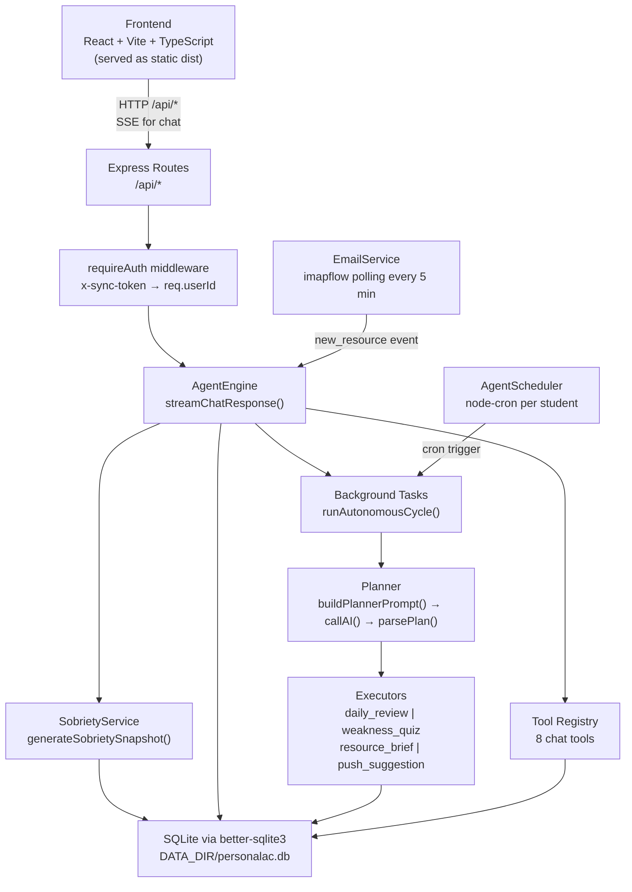
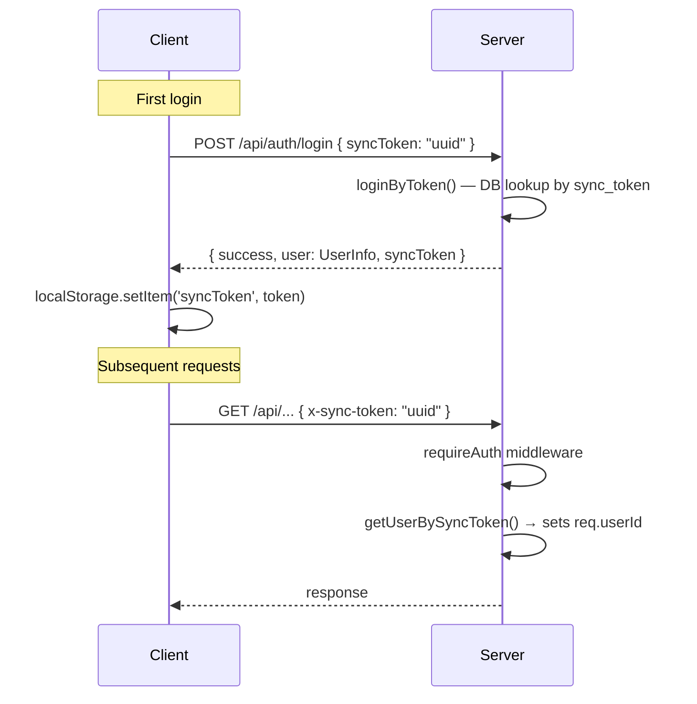
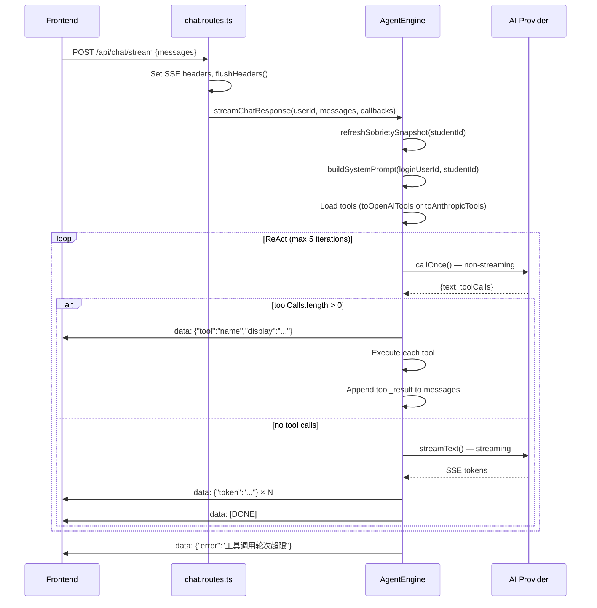
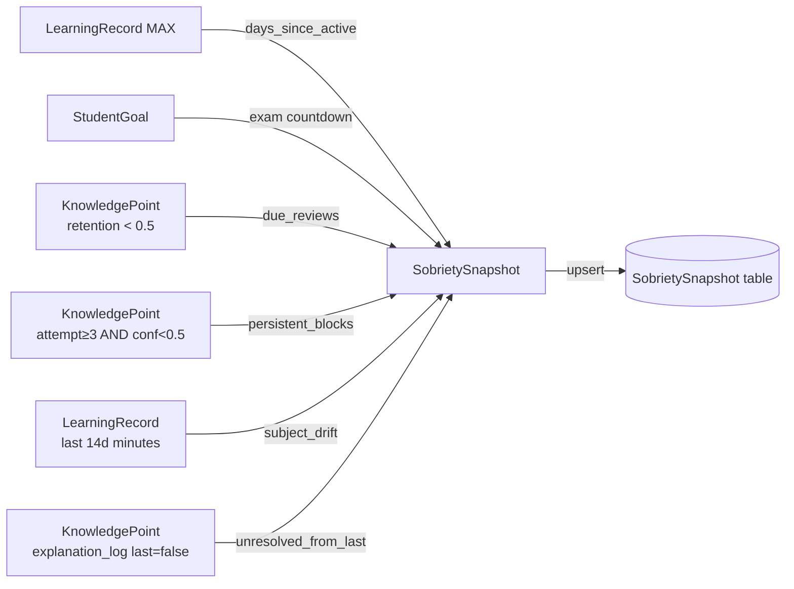
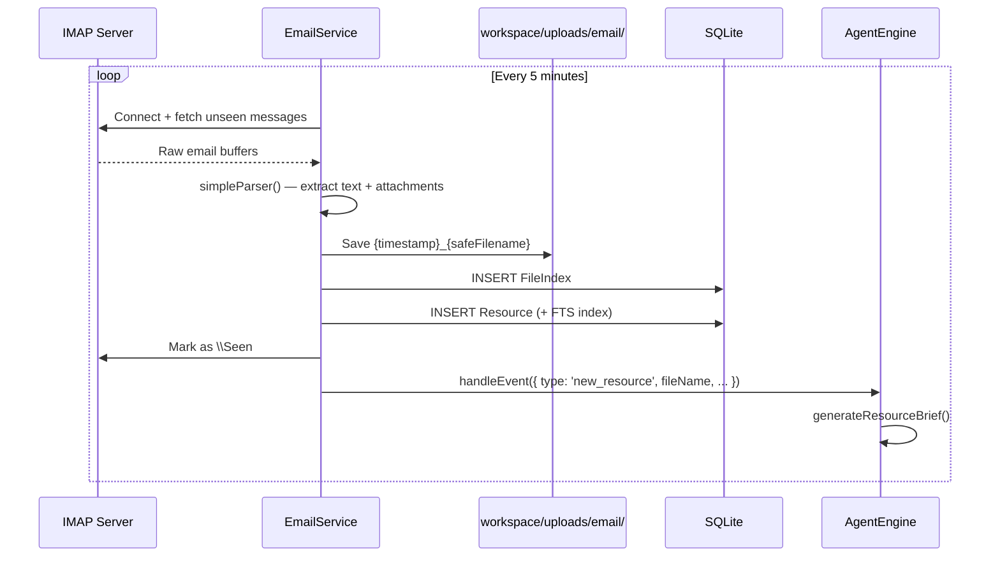
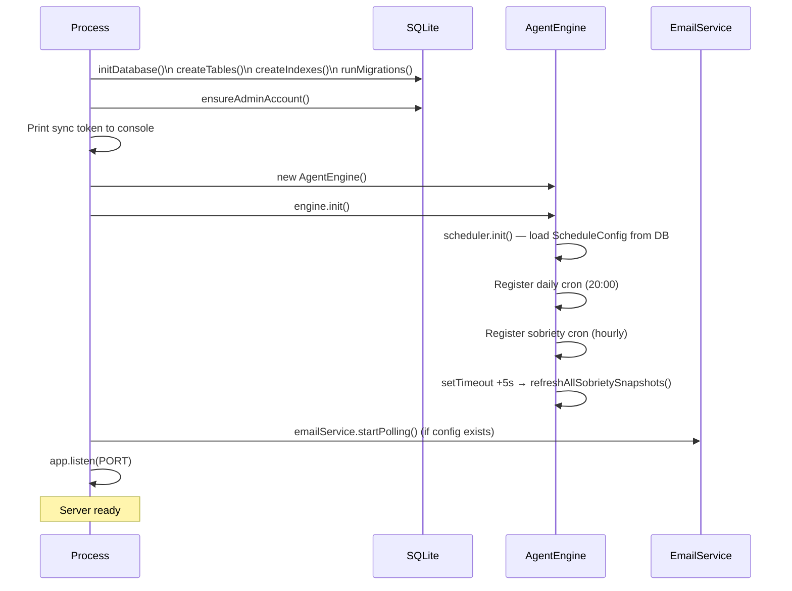

# PersonalAC v1.3 — Architecture Reference

> Developer reference document. Covers every major subsystem: data model, auth flow, ReAct chat loop, 自我清醒 sobriety system, background agent, email integration, and workspace.

---

## Table of Contents

1. [Project Overview](#1-project-overview)
2. [Repository Layout](#2-repository-layout)
3. [Layered Architecture](#3-layered-architecture)
4. [Database Schema](#4-database-schema)
5. [Authentication](#5-authentication)
6. [API Routes](#6-api-routes)
7. [Chat: ReAct Loop](#7-chat-react-loop)
8. [Reasoning Model Support](#8-reasoning-model-support)
9. [AI Tool Registry](#9-ai-tool-registry)
10. [自我清醒 (Self-Sobriety System)](#10-自我清醒-self-sobriety-system)
11. [Ebbinghaus Forgetting Curve](#11-ebbinghaus-forgetting-curve)
12. [Explanation Tracking & Prerequisite Graph](#12-explanation-tracking--prerequisite-graph)
13. [Background Agent: Planner-Executor](#13-background-agent-planner-executor)
14. [Scheduler](#14-scheduler)
15. [Email Integration](#15-email-integration)
16. [Workspace](#16-workspace)
17. [Settings & API Key Storage](#17-settings--api-key-storage)
18. [Frontend](#18-frontend)
19. [CLI (pac)](#19-cli-pac)
20. [Startup Sequence](#20-startup-sequence)

---

## 1. Project Overview

PersonalAC is a **locally-deployed, single-family learning AI assistant**. One guardian (admin) account manages one or more linked student accounts. The AI tutors students via a conversational ReAct loop, proactively monitors their learning state, and runs background tasks (daily review, weakness quiz, resource brief) autonomously.

**Key design choices:**

- **Single-process monolith** — Express server hosts the API, the AgentEngine, the scheduler, and the email poller in one Node.js process.
- **SQLite (better-sqlite3)** — all data in a single file at `$DATA_DIR/personalac.db`. WAL mode enabled.
- **Token auth (no passwords)** — each user has a UUID `sync_token` treated as a bearer credential.
- **Provider-agnostic AI** — any OpenAI-compatible API endpoint is supported; Anthropic Messages API detected by URL pattern.
- **Self-sobriety** — AI's awareness of student state is computed deterministically from the DB (no AI call), injected into every system prompt.

---

## 2. Repository Layout

```
1.3/
├── server/
│   ├── src/
│   │   ├── index.ts                  # Entry point: Express app + startup sequence
│   │   ├── database/index.ts         # SQLite init, createTables(), runMigrations()
│   │   ├── middleware/
│   │   │   └── auth.middleware.ts    # requireAuth: x-sync-token → req.userId
│   │   ├── routes/                   # HTTP handlers (one file per domain)
│   │   │   ├── auth.routes.ts
│   │   │   ├── settings.routes.ts
│   │   │   ├── plans.routes.ts
│   │   │   ├── agent.routes.ts
│   │   │   ├── email.routes.ts
│   │   │   ├── chat.routes.ts        # POST /api/chat/stream (SSE)
│   │   │   ├── data.routes.ts
│   │   │   ├── workspace.routes.ts
│   │   │   └── goals.routes.ts
│   │   ├── agent/
│   │   │   ├── index.ts              # AgentEngine (chat ReAct + background tasks)
│   │   │   ├── context.ts            # AgentContext.buildContext()
│   │   │   ├── planner.ts            # buildPlannerPrompt() + parsePlan()
│   │   │   ├── executors.ts          # Executor registry + 5 executor functions
│   │   │   └── scheduler.ts         # AgentScheduler (node-cron per student)
│   │   ├── tools/
│   │   │   ├── index.ts              # registerTool(), toOpenAITools(), toAnthropicTools()
│   │   │   └── chat-tools.ts         # 8 tools registered at module load
│   │   └── services/
│   │       ├── auth.service.ts
│   │       ├── settings.service.ts   # AES-256 encrypted API key storage
│   │       ├── sobriety.service.ts   # Self-sobriety snapshot generation
│   │       ├── email.service.ts      # IMAP polling via imapflow
│   │       ├── workspace.service.ts
│   │       ├── plan.service.ts
│   │       ├── data.service.ts
│   │       ├── resource.service.ts
│   │       └── notify.service.ts
│   ├── cli/pac.js                    # Standalone Node.js CLI (no dependencies)
│   ├── data/personalac.db            # SQLite database (gitignored)
│   └── package.json
├── frontend/
│   ├── src/
│   │   ├── api/http.ts               # All API calls; SSE stream client
│   │   ├── App.tsx                   # Router + auth guard
│   │   ├── pages/
│   │   │   ├── Login.tsx
│   │   │   ├── Setup.tsx
│   │   │   ├── Chat.tsx              # Guardian chat (markdown + tool badges)
│   │   │   ├── StudentChat.tsx       # Student-role chat view
│   │   │   ├── Plans.tsx
│   │   │   ├── AgentLogs.tsx
│   │   │   ├── AgentTasks.tsx
│   │   │   ├── Config.tsx
│   │   │   ├── Goals.tsx
│   │   │   └── Quick.tsx
│   │   └── components/
│   │       ├── Layout.tsx
│   │       ├── AgentOutput.tsx
│   │       └── MermaidChart.tsx
│   └── vite.config.ts
└── ARCHITECTURE.md
```

---

## 3. Layered Architecture



---

## 4. Database Schema

All tables use `delete_flag = 0` for soft-deletes. Timestamps are Unix ms integers except where noted. The database is initialized by `initDatabase()` in `server/src/database/index.ts` which runs `createTables()`, `createIndexes()`, and `runMigrations()` (additive `ALTER TABLE ADD COLUMN` migrations) on every startup.

```
User
  id TEXT PK
  username TEXT UNIQUE
  sync_token TEXT UNIQUE          ← bearer credential
  display_name TEXT
  role TEXT DEFAULT 'guardian'    ← 'guardian' | 'student'  (migration-added)
  student_grade TEXT              ← e.g. "高二" (migration-added)
  guardian_id TEXT                ← FK to parent User (migration-added)

Plan
  id TEXT PK
  student_id TEXT
  title TEXT
  subjects TEXT                   ← JSON array of subject names
  status TEXT CHECK('active'|'archived')

LearningRecord
  id TEXT PK
  student_id TEXT
  subject TEXT
  topic TEXT
  score INTEGER
  duration_minutes INTEGER
  record_date INTEGER              ← Unix ms of when session occurred

KnowledgePoint
  id TEXT PK
  student_id TEXT
  subject TEXT
  topic TEXT
  weakness_score REAL DEFAULT 0.5 ← 1 - confidence
  confidence REAL DEFAULT 0.5     ← 0-1, Ebbinghaus + agent updates
  stability REAL DEFAULT 1.0      ← Ebbinghaus stability factor
  data_source TEXT                ← 'guardian_upload' | 'agent_observed' | 'student_report'
  error_types TEXT                ← JSON: {type: count}
  root_cause TEXT
  explanation_log TEXT            ← JSON array, max 20 entries
  prerequisites TEXT              ← JSON array of {topic, subject}
  attempt_count INTEGER
  last_practiced INTEGER

StudentGoal
  id TEXT PK
  student_id TEXT
  exam_type TEXT                  ← e.g. "高考"
  exam_date INTEGER               ← Unix ms
  school_progress TEXT
  guardian_notes TEXT

SobrietySnapshot
  student_id TEXT PK
  snapshot TEXT                   ← full JSON of SobrietySnapshot
  generated_at INTEGER
  notified_at INTEGER
  last_urgency TEXT               ← 'idle'|'normal'|'attention'|'urgent'

AgentTask
  id TEXT PK
  task_type TEXT
  student_id TEXT
  status TEXT                     ← 'pending'|'running'|'completed'|'failed'
  trigger_type TEXT
  input_summary TEXT
  output TEXT                     ← JSON ExecutorOutput
  error TEXT
  started_at INTEGER
  completed_at INTEGER

AgentLog
  id TEXT PK
  student_id TEXT
  action_type TEXT
  action_detail TEXT
  trigger_type TEXT
  model_used TEXT
  status TEXT                     ← 'success'|'failed'|'pending'
  error_message TEXT

ScheduleConfig
  id TEXT PK
  student_id TEXT
  cron_expression TEXT
  description TEXT
  last_run INTEGER
  status TEXT                     ← 'active'|'paused'|'deleted'

Resource
  id TEXT PK
  uploader_id TEXT
  file_name TEXT
  file_path TEXT
  file_type TEXT
  file_size INTEGER
  subject TEXT
  source_email TEXT
  parsed_text TEXT                ← up to 10,000 chars of email body

ResourceFTS (fts5 virtual table)
  resource_id, file_name, subject, parsed_text
  content=Resource, content_rowid=rowid

FileIndex
  id INTEGER PK AUTOINCREMENT
  file_path TEXT
  file_name TEXT
  category TEXT
  student_id TEXT
  source_email TEXT
  tags TEXT                       ← JSON array

Settings
  id TEXT PK
  key TEXT UNIQUE
  value TEXT
  encrypted INTEGER               ← 1 if AES-256 encrypted

MessageLog
  id TEXT PK
  user_id TEXT
  direction TEXT                  ← 'inbound'|'outbound'
  content TEXT
```

**Indexes** (partial, `WHERE delete_flag=0`): `User(sync_token)`, `Plan(student_id)`, `LearningRecord(student_id)`, `KnowledgePoint(student_id)`, `AgentLog(student_id)`, `AgentTask(student_id)`, `AgentTask(status)`, `FileIndex(student_id)`.

---

## 5. Authentication

### User Model

The system has exactly two roles:

| Role | Access |
|---|---|
| `guardian` | Full app: plans, agent, settings, goals, chat (operates on linked student's data) |
| `student` | Chat only (operates on own data) |

The admin account created on first run has role `guardian`.

### First-run bootstrap

`ensureAdminAccount()` is called at every server startup:

```typescript
// server/src/services/auth.service.ts
export function ensureAdminAccount(): { syncToken: string } {
  const existing = db.prepare(
    "SELECT id, sync_token FROM User WHERE username = 'admin' AND delete_flag = 0"
  ).get()
  if (existing) return { syncToken: existing.sync_token }

  const syncToken = uuidv4()
  db.prepare(`INSERT INTO User (id, username, sync_token, role, ...) VALUES (?, 'admin', ?, 'guardian', ...)`)
    .run(uuidv4(), syncToken, ...)
  return { syncToken }
}
```

The token is printed to the server console on startup. This is the only way to obtain it on a fresh deployment.

### Authentication flow



### `requireAuth` middleware

```typescript
// server/src/middleware/auth.middleware.ts
export function requireAuth(req: AuthRequest, res, next): void {
  const token = req.headers['x-sync-token'] as string || req.cookies?.syncToken
  if (!token) { res.status(401).json(...); return }
  const user = getUserBySyncToken(token)
  if (!user) { res.status(401).json(...); return }
  req.userId = user.id
  next()
}
```

All routes under `/api/*` (except `/api/auth/login`) use this middleware.

### Student account management

Guardian creates student accounts via `POST /api/auth/students`:

```typescript
export function createStudent(guardianId: string, name: string, grade?: string): StudentRecord {
  const token = uuidv4()
  db.prepare(`INSERT INTO User (..., role, guardian_id, ...) VALUES (?, ?, ?, 'student', ?, ...)`)
    .run(id, username, token, guardianId, ...)
  return { id, name, grade, token }
}
```

Each student gets their own UUID token. The guardian shares this token with the student (e.g. by displaying it in the Setup page).

When a guardian makes a chat request, `getPrimaryStudentId(guardianId)` resolves the data target:

```typescript
// In AgentEngine.streamChatResponse():
if (loginUser?.role === 'guardian') {
  studentId = getPrimaryStudentId(userId) ?? userId
}
```

---

## 6. API Routes

| Mount | File | Key endpoints |
|---|---|---|
| `/api/auth` | auth.routes.ts | `POST /login`, `GET /me`, `POST /setup`, `GET /students`, `POST /students`, `DELETE /students/:id`, `POST /reset-token` |
| `/api/settings` | settings.routes.ts | `GET /models`, `POST /ai`, `GET /ai`, `POST /email`, `GET /email`, `POST /email/test` |
| `/api/plans` | plans.routes.ts | `POST /`, `GET /active`, `GET /` |
| `/api/agent` | agent.routes.ts | `GET /logs`, `GET /tasks`, `POST /run`, `POST /report`, `POST /dnd`, `DELETE /dnd` |
| `/api/email` | email.routes.ts | `GET /status`, `POST /start`, `POST /stop` |
| `/api/chat` | chat.routes.ts | `POST /send` (non-streaming), `POST /stream` (SSE) |
| `/api/data` | data.routes.ts | `POST /learning`, `GET /summary` |
| `/api/workspace` | workspace.routes.ts | `POST /write`, `GET /read`, `GET /list`, `DELETE /delete`, `GET /stats`, `POST /cleanup-temp` |
| `/api/goals` | goals.routes.ts | `GET /`, `POST /` |

Static frontend files are served from `$FRONTEND_DIST` (defaults to `../../frontend/dist`). All unmatched GET requests fall back to `index.html` for SPA routing.

The CLI download endpoint is conditionally enabled when `server/cli/pac.js` exists:
- `GET /cli/pac.js` — download CLI binary
- `GET /cli/install.sh` — one-line installer script

---

## 7. Chat: ReAct Loop

The entire chat implementation lives in `AgentEngine.streamChatResponse()` in `server/src/agent/index.ts`.

### SSE wire format

```
data: {"token":"..."}           ← streaming text token
data: {"tool":"name","display":"正在查询..."}  ← tool call indicator
data: {"thinking":"..."}        ← reasoning model thinking token
data: [DONE]                    ← stream end
data: {"error":"..."}           ← error
```

The frontend client in `frontend/src/api/http.ts` parses this stream using the Fetch ReadableStream API (no EventSource, allowing POST with a body).

### Flow diagram



### `buildSystemPrompt()` structure

The system prompt is assembled fresh for every request:

1. **Role detection** — `guardian` gets a data-oriented prompt; `student` gets a tutoring-oriented prompt
2. **Active plan** — subjects read from `Plan` table
3. **Goal section** — exam type, countdown, school progress, guardian notes from `StudentGoal`
4. **清醒视角 injection** — `getOrRefreshSnapshot(studentId, 30min)` called; non-empty `today_priority` injected with urgency tag

Example injected line (student prompt):
```
清醒视角【紧迫】：距高考 28 天（2026-06-07）；上次学习：3 天前；待复习：导数（保留率34%）、极限（保留率41%）
```

The student prompt also contains **清醒原则** — behavioural instructions telling the AI to proactively lead the session based on this awareness rather than passively waiting for questions.

---

## 8. Reasoning Model Support

Detection regex (applied to model name):

```typescript
const isReasoning = /o1|o3|o4[-/]|thinking|reason/i.test(model)
```

This matches: `o1`, `o3`, `o4-mini`, `o4/...`, `claude-3-7-sonnet-thinking`, any model containing `reason`.

| Provider | Reasoning config |
|---|---|
| **Anthropic** | Adds `thinking: { type: 'enabled', budget_tokens: 8000 }` to request body |
| **OpenAI** | Moves system prompt to first user message (`[System instructions]\n{systemPrompt}`); adds `reasoning_effort: 'medium'`; omits `temperature` |

Thinking tokens are surfaced to the frontend:
- Anthropic: `delta.type === 'thinking_delta'` → `onThinking?.('thinking', delta.thinking)`
- OpenAI: `delta.reasoning` → same callback

Frontend renders these as animated `ThinkingBadge` components while the final answer streams.

---

## 9. AI Tool Registry

Tools are registered once at module load time via `import './tools/chat-tools'` in `server/src/index.ts`.

```typescript
// server/src/tools/index.ts
export interface ToolDef {
  name: string
  description: string
  input_schema: { type: 'object'; properties: Record<string, unknown>; required?: string[] }
  execute(params: Record<string, unknown>, ctx: ToolContext): Promise<string>
}

export interface ToolContext {
  userId: string    // logged-in user
  studentId: string // data target (may differ from userId for guardian)
}
```

`toOpenAITools()` and `toAnthropicTools()` convert the registry to the respective API formats at chat time.

### Registered tools (8 total)

| Tool | Trigger condition |
|---|---|
| `get_student_summary` | Before answering progress/status questions |
| `update_knowledge` | After verifying understanding via quiz; after guardian uploads grades/exam |
| `set_plan` | Guardian sets or changes learning direction |
| `record_learning` | Any mention of a learning activity in conversation |
| `log_explanation` | After a clear explain→feedback loop (understood=true or false) |
| `link_prerequisite` | Student blocks on topic B after 2 methods; AI identifies topic A as blocker |
| `check_prerequisites` | Before teaching a topic; after calling `link_prerequisite` |
| `get_sobriety` | AI needs full sobriety detail beyond the system prompt summary |

`update_knowledge` also updates the Ebbinghaus `stability` field:
```typescript
const newStability = confidence > 0.65
  ? Math.min(prevStability * 1.8 + 1, 60)   // correct review
  : Math.max(prevStability * 0.5, 0.5)       // failed review
```

---

## 10. 自我清醒 (Self-Sobriety System)

> The AI's persistent awareness of student state. NOT a push notification system — it is a deterministic DB snapshot injected into every session's system prompt so the AI begins each conversation already knowing the situation.

### Concept

Without sobriety: the AI waits passively for the student to ask questions, and has no memory of urgency between sessions.

With sobriety: the AI enters each session already knowing "exam in 28 days, 导数 retention at 34%, last session was 3 days ago, student left confused about 极限 last time". This drives proactive session leadership.

### `SobrietySnapshot` structure

```typescript
interface SobrietySnapshot {
  generated_at: number
  days_since_active: number | null        // days since last LearningRecord
  exam: { type, date, days_left } | null  // from StudentGoal
  due_reviews: Array<{                    // Ebbinghaus retention < 0.5
    topic, subject, retention, days_overdue
  }>
  persistent_blocks: Array<{              // attempt_count >= 3 AND confidence < 0.5
    topic, subject, root_cause, attempts
  }>
  subject_drift: {
    recent_distribution: Record<string, number>  // subject → % of last 14 days
    primary_subject: string | null
    drift_warning: string | null            // only when exam < 60 days
  }
  unresolved_from_last: string | null     // last explanation_log entry with understood=false
  urgency: { level: UrgencyLevel; reasons: string[] }
  today_priority: string                  // ≤400 char Chinese summary for system prompt
}

type UrgencyLevel = 'idle' | 'normal' | 'attention' | 'urgent'
```

### Generation logic (`generateSobrietySnapshot`)

All computation is pure DB queries, no AI calls:



**Urgency escalation rules:**
- `urgent` — exam within 30 days
- `attention` — exam within 90 days; OR 3+ days since last session; OR 3+ due reviews
- `normal` — default when data exists
- `idle` — no learning records at all

### Data flow

```
[Hourly cron 0 * * * *]
    → refreshAllSobrietySnapshots()
        → generateSobrietySnapshot(studentId) — DB only, no AI
        → saveSobrietySnapshot() — upsert to SobrietySnapshot table
        → if urgency escalated to 'urgent' → logAction('sobriety_alert')
        → markNotified() — prevents duplicate alerts

[Chat open]
    → refreshSobrietySnapshot(studentId)  (unconditional, pre-prompt)
    → buildSystemPrompt()
        → getOrRefreshSnapshot(studentId, maxAge=30min)
        → if today_priority != '暂无紧迫事项':
            inject "清醒视角【tag】：{today_priority}" into system prompt

[Server startup +5s]
    → refreshAllSobrietySnapshots()  (cold-start refresh)

[AI tool call: get_sobriety]
    → getOrRefreshSnapshot(studentId, maxAge=5min)
    → returns full JSON snapshot to AI
```

### Urgency tags in system prompt

| Level | Tag injected |
|---|---|
| `urgent` | `【紧迫】` |
| `attention` | `【关注】` |
| `normal` or `idle` | (no tag) |

---

## 11. Ebbinghaus Forgetting Curve

```
retention = e^( -days_since_review / (stability × 5) )
```

**Stability update after each `update_knowledge` call:**

```typescript
const newStability = confidence > 0.65
  ? Math.min(prevStability * 1.8 + 1, 60)   // successful recall: grow (capped at 60)
  : Math.max(prevStability * 0.5, 0.5)       // failed recall: decay (floor at 0.5)
```

**Initial values:**
- `stability = 1.0` for all new knowledge points
- `confidence = 0.5` unless set explicitly

**Review trigger:** `retention < 0.5` → included in `due_reviews` in the sobriety snapshot

**Practical meaning of stability values:**

| stability | Days until retention=0.5 |
|---|---|
| 1.0 (new) | 3.5 days |
| 2.8 (1 correct) | 9.8 days |
| 6.0 (2 correct) | 20.8 days |
| 11.8 (3 correct) | 41 days |
| 60 (capped) | 208 days |

---

## 12. Explanation Tracking & Prerequisite Graph

### `explanation_log` column on KnowledgePoint

JSON array, capped at 20 entries. Each entry:

```typescript
{
  method: string        // "公式推导" | "具体数值例子" | "类比生活场景" | "图示" | "反例"
  understood: boolean
  root_cause?: string   // only when understood=false
  note?: string
  date: number          // Unix ms
}
```

The `log_explanation` tool appends to this array. If `understood=false`, the AI is expected to fill `root_cause` with the specific sticking point (not just "didn't understand").

In `get_student_summary`, the tool parses `explanation_log` and returns:
```json
{
  "workedMethods": ["具体数值例子"],
  "failedMethods": ["公式推导", "类比生活场景"]
}
```

This prevents the AI from repeating a failed method.

### `prerequisites` column on KnowledgePoint

JSON array of `{topic, subject}`. This graph is **reactive, not pre-built** — it is created only when evidence of a dependency emerges from the session.

**Prerequisite teaching protocol** (encoded in the student system prompt):

```
1. Student cannot understand topic B after 2 methods
   → AI calls check_prerequisites(B) — diagnoses existing gaps
   → AI calls link_prerequisite(B, A) — records new dependency
   → AI calls check_prerequisites(B) — confirms A is indeed weak
   → AI switches to teaching A
   → When A is mastered: "现在来看之前那道题" — resume B
```

The `check_prerequisites` tool returns a `recommendation` field:
- "所有前置掌握良好，可以直接讲当前知识点。"
- "发现 N 个前置不足：X（明显薄弱），建议先补…"

`prerequisiteGaps` (prerequisites with confidence < 0.7) are surfaced in the `get_student_summary` output for each weak point.

---

## 13. Background Agent: Planner-Executor

The background agent runs autonomously, separate from chat. Its entry point is `AgentEngine.runAutonomousCycle(studentId)`.

```mermaid
flowchart TD
    E[Event / Cron trigger]
    GUARD{AI configured?}
    CTX[AgentContext.buildContext\npulls plan, weak points,\nrecent records, resources,\nrecent AgentLog]
    P[buildPlannerPrompt\nJSON-only prompt]
    AI1[callAI\nnon-streaming]
    PARSE[parsePlan\nJSON.parse from response]
    FILTER[filter tasks where\ntype != no_action]
    PAR[Promise.all executors in parallel]
    EXEC[getExecutor\ntype → function]
    CALL[executor\ntask, context, aiConfig, callAI]
    SE[applySideEffect\nbot_message | set_schedule]
    LOG[logAction → AgentLog]

    E --> GUARD
    GUARD -->|no| LOG
    GUARD -->|yes| CTX
    CTX --> P
    P --> AI1
    AI1 --> PARSE
    PARSE --> FILTER
    FILTER --> PAR
    PAR --> EXEC
    EXEC --> CALL
    CALL --> SE
    CALL --> LOG
```

### Stage 1: Context

`AgentContext.buildContext(studentId)` returns `AgentContextData`:

```typescript
{
  studentId, studentName,
  activePlan: { title, description, subjects[] } | null,
  weakPoints: top-10 by weakness_score (last 7d),
  recentRecords: last 20 records in past 7 days,
  resources: last 20 resources,
  recentSuggestions: last 5 successful AgentLog entries  // prevents repetition
}
```

### Stage 2: Planner

`buildPlannerPrompt(context)` produces a prompt that asks the AI to output **only JSON**:

```json
{
  "thinking": "…1-3 sentence analysis…",
  "tasks": [
    { "type": "daily_review", "priority": "high", "reason": "…", "params": {} }
  ]
}
```

**Available task types** the planner can schedule:

| Type | When |
|---|---|
| `push_suggestion` | Clear weak points or no recent activity |
| `daily_review` | Evening; not run today yet |
| `weakness_quiz` | High weakness score + low attempt count |
| `resource_brief` | New resource arrived |
| `set_schedule` | Planner wants to create a future cron (params: `cron`, `description`) |
| `no_action` | Nothing needed |

Rules: each type at most once per cycle; skip recently-executed types (checked via `recentSuggestions`).

### Stage 3: Executors

Executor signature:

```typescript
type Executor = (
  task: PlannedTask,
  context: AgentContextData,
  aiConfig: AIConfig,
  callAI: CallAI
) => Promise<ExecutorResult>
```

`ExecutorResult` includes:
- `output?: { type: 'text' | 'mermaid' | 'knowledge_card'; content: string }`
- `sideEffects?: Array<BotMessageEffect | SetScheduleEffect>`

Output is parsed with `parseOutput()` which looks for `<MERMAID>...</MERMAID>` and `<KNOWLEDGE_CARD>...</KNOWLEDGE_CARD>` tags.

### Executor registry

```typescript
const registry = {
  push_suggestion:  suggestionExecutor,
  daily_review:     dailyReviewExecutor,
  weakness_quiz:    weaknessQuizExecutor,
  resource_brief:   resourceBriefExecutor,
  set_schedule:     scheduleExecutor  // no AI call needed
}
```

### Duplicate protection

- `processingStudents: Set<string>` — per-student mutex; if a cycle is already running, the new trigger is silently dropped.
- Do-not-disturb window (`doNotDisturb: {start, end}`) — autonomous cycles are skipped entirely during this window. Set via `POST /api/agent/dnd`.

### Direct trigger methods

In addition to the autonomous cycle, tasks can be triggered directly:

| Method | Trigger source |
|---|---|
| `generateDailyReview(studentId)` | Daily cron at 20:00 |
| `generateWeaknessQuiz(studentId)` | Manual via `POST /api/agent/run` |
| `generateResourceBrief(resourceInfo)` | Email poller (new_resource event) |
| `generateBotResponse(userId, message)` | bot_message event |

---

## 14. Scheduler

`AgentScheduler` (in `server/src/agent/scheduler.ts`) manages per-student cron jobs using `node-cron`.

**Lifecycle:**
1. `init()` — loads all `ScheduleConfig` rows with `status='active'` from DB, registers cron jobs in memory
2. `createSchedule(studentId, cronExpression, description)` — validates cron, inserts into DB, registers in memory
3. `removeSchedule(scheduleId)` — stops cron job, sets DB `status='deleted'`
4. When a cron fires → `onTrigger(studentId, scheduleId, description)` → `AgentEngine.handleEvent({ type: 'new_learning_data', ... })` → `runAutonomousCycle()`

**Missed task compensation:**
`compensateMissedTasks()` checks schedules where `last_run < 1 hour ago`. If the cron expression would have fired in that window, a compensated run is triggered. This handles server restarts.

**Built-in crons (not in ScheduleConfig):**

| Cron | Handler |
|---|---|
| `0 20 * * *` | `generateDailyReview('superadmin')` |
| `0 * * * *` | `refreshAllSobrietySnapshots()` |

---

## 15. Email Integration

`emailService` (singleton in `server/src/services/email.service.ts`) uses `imapflow` for IMAP and `mailparser` for body/attachment parsing.



**Attachment storage path:** `$DATA_DIR/workspace/uploads/email/{timestamp}_{safeFilename}`

Filenames are sanitized: `filename.replace(/[^a-zA-Z0-9._-]/g, '_')`

**Email config** is stored in `Settings` table under keys `email_address`, `email_auth_code`, `email_imap_host`, `email_imap_port`. The auth code (app password) is AES-256 encrypted at rest.

**SMTP outbound:** not yet implemented. Agent notifications are stored in `AgentLog` only. The `notify.service.ts` stub writes to `MessageLog`.

**Email polling** only starts automatically if config exists at startup. It can be started/stopped at runtime via `POST /api/email/start` and `POST /api/email/stop`.

---

## 16. Workspace

Per-process file area rooted at `$DATA_DIR/workspace/`. All path operations go through `WorkspaceService.resolveSafe()` which enforces that the resolved absolute path stays within `workspaceRoot` (path traversal prevention).

### Routes

| Route | Operation |
|---|---|
| `POST /api/workspace/write` | `{ relativePath, content }` → write file |
| `GET /api/workspace/read?path=` | Read file as Buffer |
| `GET /api/workspace/list?path=` | Directory listing |
| `DELETE /api/workspace/delete?path=` | Unlink + mark FileIndex deleted |
| `GET /api/workspace/stats` | Disk usage, free space, warning flag |
| `POST /api/workspace/cleanup-temp` | Delete temp/ files older than 7 days |

**Disk warning:** when free disk < 500 MB, `write()` logs a warning but still proceeds. The `workspace_full` event (emitted from agent) triggers `cleanupTemp()`.

### Local proxy mode

When the `pac` CLI runs locally with `pac serve`, it starts a workspace proxy server at `http://127.0.0.1:7474`. The frontend detects this proxy with a 1.5s probe on startup (`probeWorkspaceProxy()`). If available, workspace API calls are routed to `PROXY_BASE = 'http://127.0.0.1:7474/api'` instead of `/api` — enabling direct local file access without round-tripping to the remote server.

---

## 17. Settings & API Key Storage

Settings are stored in the `Settings` table as key-value pairs. Sensitive values are AES-256-CBC encrypted.

**Encryption:**

```typescript
const ENC_KEY = crypto.createHash('sha256')
  .update(process.env.ENCRYPT_SECRET || 'personalac-default-secret-key')
  .digest()  // 32 bytes

// Encrypt: random IV (16 bytes) prepended to ciphertext, stored as "ivHex:ciphertextHex"
// Decrypt: split on ':', decode IV, decipher
```

The `ENCRYPT_SECRET` env var should be set in production. For local deployment the default is acceptable.

**Model discovery:** `getModels()` fetches `https://models.dev/api.json` (live model catalog), caches the response in `Settings('last_model_json')`, and normalizes it into `AIModel[]`. Falls back to a hardcoded list of 3 models if the fetch fails.

**Provider/model ID format:** `models.dev` uses `"provider/model"` composite IDs. The engine strips the provider prefix before calling the API:
```typescript
const finalModel = rawModel.includes('/') ? rawModel.split('/').slice(1).join('/') : rawModel
```

**Anthropic detection:**
```typescript
const isAnthropic = finalBaseUrl.includes('/anthropic') || finalBaseUrl.includes('anthropic.com')
```

---

## 18. Frontend

React 18 + Vite + TypeScript. No UI framework — all styling is inline styles + CSS custom properties (`--primary`, `--bg`, `--text`).

### Pages

| Page | Route | Role |
|---|---|---|
| `Login.tsx` | `/login` | All |
| `Setup.tsx` | `/setup` | Guardian (first run) |
| `Chat.tsx` | `/` | Guardian |
| `StudentChat.tsx` | `/student` | Student |
| `Plans.tsx` | `/plans` | Guardian |
| `Config.tsx` | `/config` | Guardian |
| `AgentLogs.tsx` | `/logs` | Guardian |
| `AgentTasks.tsx` | `/tasks` | Guardian |
| `Goals.tsx` | `/goals` | Guardian |
| `Quick.tsx` | `/quick` | Guardian |

### SSE streaming (frontend side)

`chatApi.stream()` in `frontend/src/api/http.ts` uses `fetch` + `ReadableStream` to parse SSE frames manually. This allows POST requests with a body (standard `EventSource` only supports GET).

```typescript
// Simplified stream parser
for (const line of lines) {
  if (!line.startsWith('data: ')) continue
  const raw = line.slice(6).trim()
  if (raw === '[DONE]') { onDone(); return }
  const p = JSON.parse(raw)
  if (p.token)    onToken(p.token)
  if (p.tool)     onThinking?.(p.tool, p.display)
  if (p.thinking) onThinking?.('thinking', p.thinking)
  if (p.error)    onError(p.error)
}
```

### Rich output rendering

Agent task output can contain embedded rich content:
- `<MERMAID>...</MERMAID>` → rendered by `MermaidChart.tsx` using the `mermaid` library
- `<KNOWLEDGE_CARD>{json}</KNOWLEDGE_CARD>` → rendered by `AgentOutput.tsx` as a structured card
- Plain text → rendered as markdown via `marked` (GFM + breaks enabled)

---

## 19. CLI (pac)

`server/cli/pac.js` is a **self-contained, zero-dependency** Node.js 18+ script. It uses only built-in modules (`fs`, `os`, `path`, `http`, `https`, `readline`, `child_process`).

**Install:**
```sh
curl -fsSL https://your-server.com/cli/install.sh | sh
# installs to ~/.local/bin/pac
```

**Key commands:**

| Command | Description |
|---|---|
| `pac login <server-url>` | Prompts for sync token, saves to `~/.personalac.json` (mode 0600) |
| `pac status` | Shows server + agent status |
| `pac serve` | Starts local workspace proxy at `127.0.0.1:7474` |
| `pac workspace list` | List workspace files |
| `pac workspace push <file>` | Upload file to workspace |

**Config file:** `~/.personalac.json` stores `{ serverUrl, syncToken }`.

**PID file:** `~/.personalac.pid` tracks the background proxy process.

**Workspace proxy:** when `pac serve` runs, it spawns itself with the internal command `__workspace_proxy__` and binds a local HTTP server on port 7474 that proxies workspace API calls to the configured remote server, forwarding the `x-sync-token` header. This allows the frontend's workspace API to target `http://127.0.0.1:7474` for potentially better local file performance.

---

## 20. Startup Sequence



**Graceful shutdown** (SIGINT / SIGTERM):
1. `emailService.stopPolling()`
2. `engine.scheduler.destroy()` — stops all cron jobs
3. `closeDatabase()` — flushes WAL
4. `process.exit(0)`

**Environment variables:**

| Variable | Default | Description |
|---|---|---|
| `PORT` | `3000` | HTTP listen port |
| `DATA_DIR` | `./data` | SQLite + workspace root |
| `FRONTEND_DIST` | `../../frontend/dist` | Path to built frontend |
| `ENCRYPT_SECRET` | (hardcoded default) | AES key for API key encryption |
| `CORS_ORIGIN` | `http://localhost:5173` | Allowed CORS origin |
| `CLI_DIR` | `../cli` | Path to pac.js for download endpoint |
| `NOTIFY_FILE` | (unset) | If set, chat activity writes a JSON heartbeat file |
