# PersonalAC 技术设计文档

---

## 一、需求概述（Requirement Overview）

### 1.1 项目目标

PersonalAC 是一个面向学生的**个性化学习辅助系统**，属于开源项目，完全本地部署，数据不出用户设备。

系统以**自主 Agent** 为核心。Agent 不是一个固定的工作流执行器，而是一个具备自主编排能力的智能体——用户（或监护人）设定学习大方向和目标，Agent 在范围内自由决定何时采集数据、何时推送建议、以何种方式回应用户，实现真正的**个性化学习陪伴**。

系统将多个角色（服务人/学生、监护人、教师）连接在一起。角色之间通过接入的**外部 Bot**（如微信、Telegram、WhatsApp 等）进行通信，凡是 OpenClaw 支持的 Bot，PersonalAC 均可接入。Agent 支持多模态输入（文本、图片、文档等各种格式），拥有自己的**本地 Workspace**，可以在其中读写文件、管理资源、组织学习内容。

技术栈：**Electron 桌面应用** + **SQLite 本地数据库** + **models.dev 模型注册中心**（通过 models.dev API 发现和选择可用 AI 模型，实际调用走各模型提供商的 API，如 Anthropic、OpenAI、Google 等）。

### 1.2 核心价值

- **服务人（学生）**：获得个性化的、主动的学习陪伴——Agent 会主动观察、主动推送、主动调整，而非被动等待提问
- **监护人**：设定学习大方向后即可放手，Agent 代为跟进落地，并通过 Bot 随时了解进展，工作量大幅降低
- **教师**：上传资源后 Agent 自动整合到学习路径中，通过 Bot 与Agent沟通，减少重复沟通成本

### 1.3 非目标范围

- 不提供云端同步与多设备共享（数据完全本地）
- 不替代正式教学管理系统（如学校 OA、教务系统）
- 不自动向外网发送学生隐私数据
- 不提供在线组队或多人实时协作功能

---

## 二、业务场景

### 用户角色

| 角色 | 说明 | 权限 |
|---|---|---|
| **服务人（Student）** | 核心用户，即被辅助的学生 | 使用 Agent、提交学习数据、查看建议、通过 IM与Agent沟通 |
| **监护人（Guardian）** | 默认管理员角色 | 设定学习方向、安装/配置 Bot、管理权限、查看学生数据、通过 IM与Agent沟通 |
| **教师（Teacher）** | 教学辅助角色 | 上传学习资源、查看学生数据、通过IM与Agent沟通 |

> **角色自治规则**：监护人是系统默认管理员。当服务人未绑定监护人时，服务人自身担任监护人角色（self-guardian），拥有全部管理员权限，包括 Bot 的安装与配置。

### 场景描述

- 学生在日常学习中缺乏针对性指导，Agent 根据学习数据自主判断薄弱环节，选择合适的时机主动推送建议和练习
- 监护人为孩子设定"本学期数学重点突破函数和几何"这样的大方向后，不需要每天手动跟进——Agent 自行规划每日复习节奏、推送练习、汇报进展
- 教师将试卷、讲义等资源上传后，Agent 自动将其纳入学生的学习资源池，并在合适的时机推荐给学生
- 监护人通过微信 Bot 收到 Agent 发来的"今日学习报告"，直接在微信里回复"这周末加强一下英语"，Agent 收到后自动调整方向
- 教师通过 Telegram Bot 向学生发送一份 PDF 试卷，Agent 自动解析识别题目内容并整合进学习计划
- 管理员布置命令要求检查作业，让服务人上传作业，并获得错题信息

### 用户目标

- 学生可以在无额外监督下，获得持续的、个性化的、主动的学习路径引导
- 监护人可以通过 Bot 低成本地了解和干预学生的学习节奏
- 教师资源可以精准触达每位学生，沟通通过已有的社交平台完成，无需额外学习新工具
- Agent 自主编排一切——定时唤醒、数据采集、建议推送、方向调整——用户只需设定目标并在需要时介入

---

## 三、系统架构设计

### 3.1 架构设计原则

系统采用**分层架构（Layered Architecture）**，运行在用户本地设备（Electron 桌面应用）上，核心目标：

- 职责清晰
- 模块解耦
- Agent 自主性优先——架构围绕 Agent 的决策自由度设计，而非围绕固定流程
- 完全离线可用（AI 调用和 Bot 通信除外）
- 易于开源社区扩展

### 3.2 系统整体架构

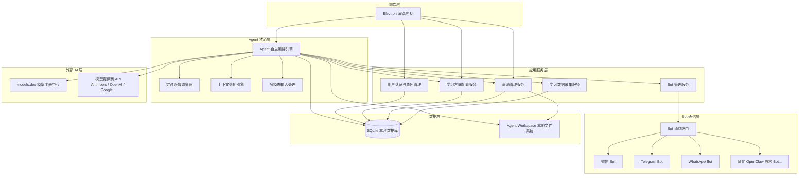

### 3.3 技术选型说明

| 层次 | 技术选型 | 说明 |
|---|---|---|
| 客户端框架 | Electron | 跨平台桌面应用，支持 Windows / macOS / Linux |
| 前端渲染 | React + TypeScript | 组件化 UI 开发 |
| 进程间通信 | Electron IPC | 渲染层与主进程之间的消息通信 |
| 本地数据库 | SQLite（better-sqlite3） | 零配置、单文件数据库，适合本地部署 |
| Agent Workspace | 本地文件系统（AppData 子目录） | Agent 的专属工作空间，存放资源文件、临时文件、生成内容 |
| AI 模型发现 | models.dev API | 查询可用模型列表、能力、价格等元信息 |
| AI 模型调用 | 各提供商 SDK/API | 根据用户选择的模型，调用对应提供商接口（Anthropic SDK、OpenAI SDK 等） |
| Bot 通信 | OpenClaw 兼容 Bot 协议 | 支持微信、Telegram、WhatsApp、Discord、Signal 等所有 OpenClaw 支持的 Bot |
| 定时任务 | node-cron（主进程） | Agent 自设定时唤醒调度 |
| 多模态处理 | 各 AI 模型原生能力 | 图片/文档/PDF 等通过模型的多模态输入能力处理 |
| 加密存储 | Electron safeStorage | 保护本地敏感配置（如 API Key） |

---

## 四、业务流程设计

### 4.1 Agent 自主编排机制

与传统的固定工作流系统不同，PersonalAC 的 Agent 采用**自主编排**模式，所以对模型的原生依赖较高。Agent 的行为不是由预设的 if-else 流程决定，而是基于以下输入自主决策：

**Agent 的决策输入：**
- 用户/监护人设定的学习大方向（Plan）
- 历史学习数据与当前薄弱点
- 可用的学习资源
- 当前时间与上下文（如距上次建议的间隔、是否临近考试等）
- 通过 Bot 收到的消息指令

**Agent 可自主执行的动作：**
- 给自己设置定时唤醒（如"明天早上 8 点提醒学生复习昨天的错题"）
- 主动推送学习建议或练习
- 调整学习计划的优先级和节奏
- 通过 Bot 向监护人/教师发送学习报告
- 解析用户上传的多模态内容（图片、文档等）并整合到学习数据中
- 在 Workspace 中组织和管理学习材料

**Agent 不可自主执行的动作（需人工确认）：**
- 更改学习大方向（需监护人确认）
- 安装或卸载 Bot（需管理员权限）
- 删除学习数据或资源

### 4.2 核心业务流程

#### 1. Agent 自主唤醒与推送流程

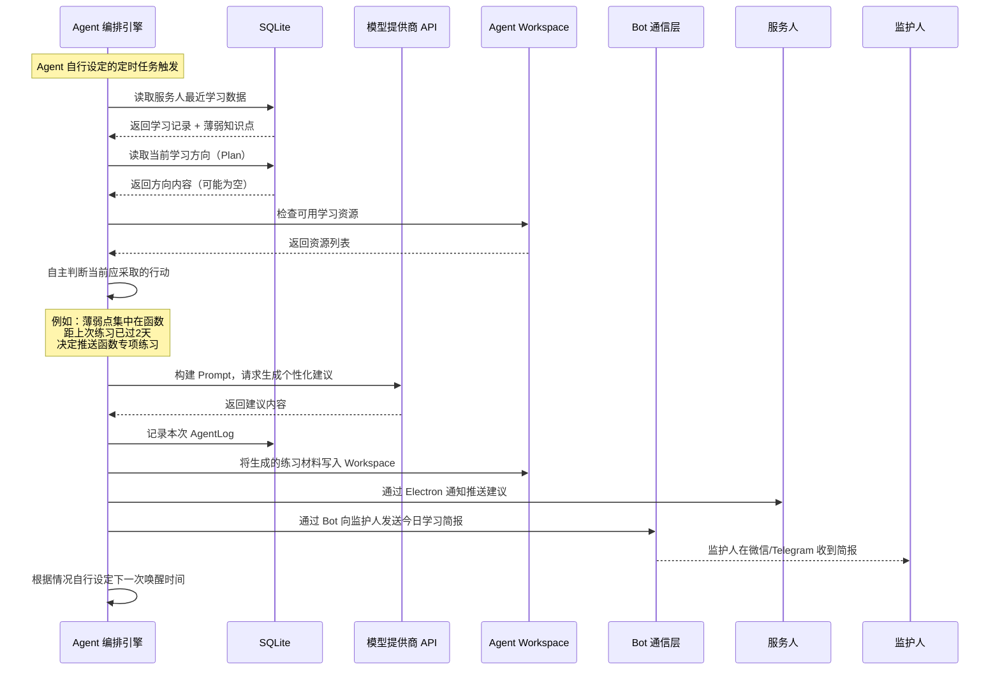

#### 2. 角色间通过 Bot 通信流程

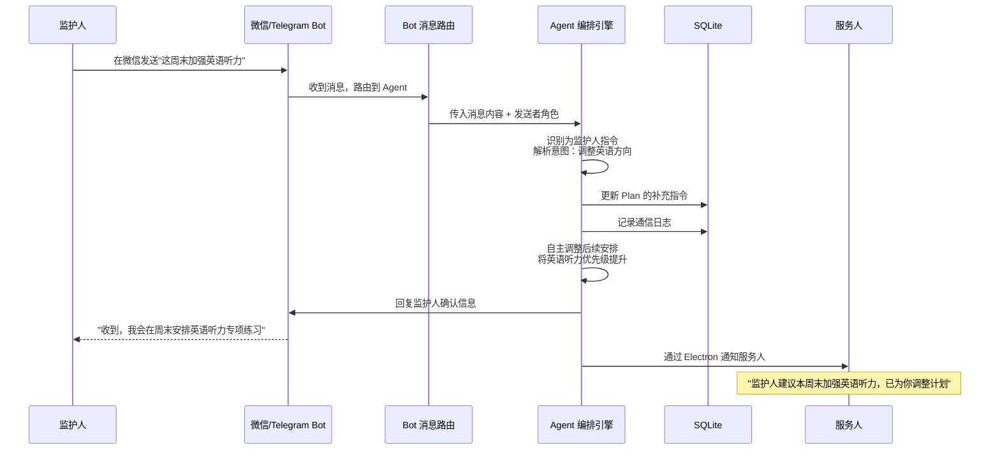

#### 3. 多模态输入处理流程

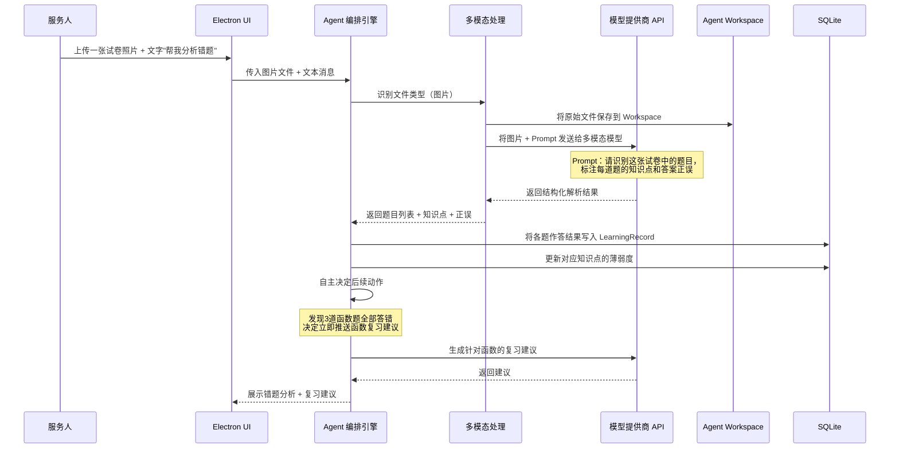

#### 4. 监护人配置学习方向流程

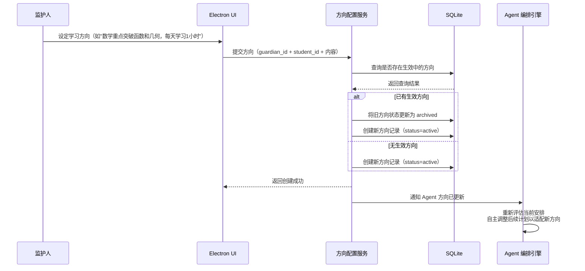

#### 5. 教师上传资源流程

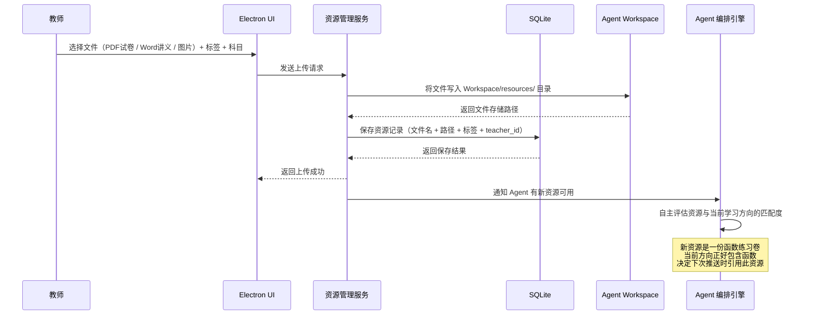

---

## 五、模块设计（Module Design）

### 5.1 用户认证与角色管理模块

#### 5.1.1 注册（本地账号创建）

**接口定义**

- 创建本地账号
- 接口（IPC 通道）：`auth:register`
- 用户在首次使用时创建本地账号，选择角色（服务人 / 监护人 / 教师）

**接口时序图**

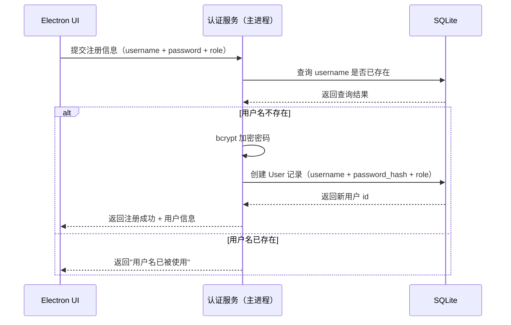

**接口需求**

- 参数验证：username 不可为空，最大长度 50 字符；password 不可为空，最小长度 6 字符；role 必须为合法枚举值（student / guardian / teacher）
- 业务规则：同一本地设备上用户名唯一；首个注册的 guardian 角色用户默认成为系统管理员

**接口实现逻辑**

- 参数校验：校验 username、password 格式；校验 role 合法性
- 用户名唯一性验证：查询 User 表，存在则拒绝
- 密码处理：使用 bcrypt（saltRounds=10）加密密码，不存储明文
- 创建用户：写入 User 表，记录 create_time 和 role
- 注册成功：返回 user_id、username、role，前端自动跳转登录态

#### 5.1.2 登录（本地账号登录）

**接口定义**

- 本地账号登录
- 接口（IPC 通道）：`auth:login`
- 用户通过 username + password 登录，返回 session token，后续接口通过 token 鉴权

**接口时序图**

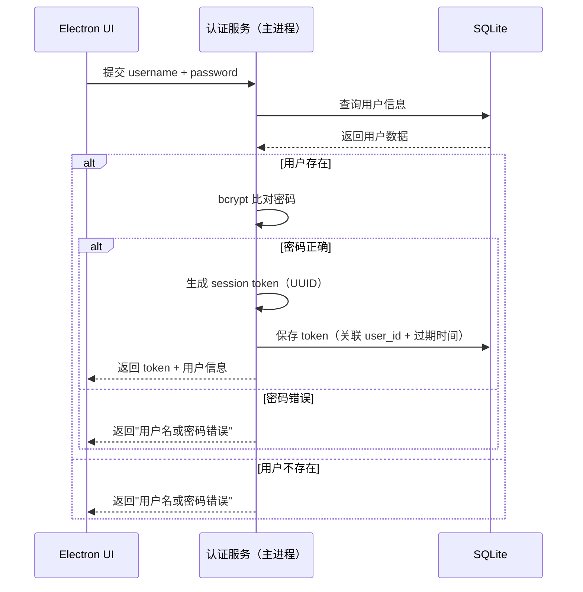

**接口需求**

- 参数验证：username、password 均不可为空
- 安全要求：连续登录失败 5 次，锁定账号 10 分钟；token 有效期 7 天（可配置）
- 业务规则：登录成功后记录 last_login_time；token 存储在 Electron 主进程内存及 SQLite 中

**接口实现逻辑**

- 参数校验：校验字段不为空
- 用户验证：查询 User 表，bcrypt 比对密码
- 失败计数：查询 LoginAttempt 表，超限返回锁定提示
- Token 生成：生成 UUID v4 作为 session token，写入 Session 表
- 登录成功：返回 token、user_id、username、role；更新 last_login_time
- 异常处理：用户不存在或密码错误统一返回"用户名或密码错误"（防枚举攻击）

#### 5.1.3 绑定监护人与服务人关系

**接口定义**

- 绑定关系
- 接口（IPC 通道）：`auth:bind`
- 监护人绑定一个或多个服务人（学生），绑定后监护人可为其设定方向并查看数据

**接口需求**

- 参数验证：token 有效；student_id 对应用户存在且角色为 student
- 业务规则：一个监护人最多绑定 10 个服务人；一个服务人只能有一个监护人（后绑定者覆盖前者）；服务人若未被绑定，自动拥有监护人权限（self-guardian）

**接口实现逻辑**

- 校验双方用户存在
- 检查 Binding 表，更新或新建绑定关系
- 写入 binding_time，更新服务人的 guardian_id 字段
- 若服务人原为 self-guardian，绑定后清除该标记

---

### 5.2 学习方向配置模块

> 注意：这里说的"方向"不是具体的每日计划——Agent 会基于方向自主编排具体行动。监护人只需设定大方向和边界条件。

#### 5.2.1 设定学习方向

**接口定义**

- 设定学习方向
- 接口（IPC 通道）：`plan:create`
- 监护人（或 self-guardian 服务人）为指定服务人设定学习大方向

**接口时序图**

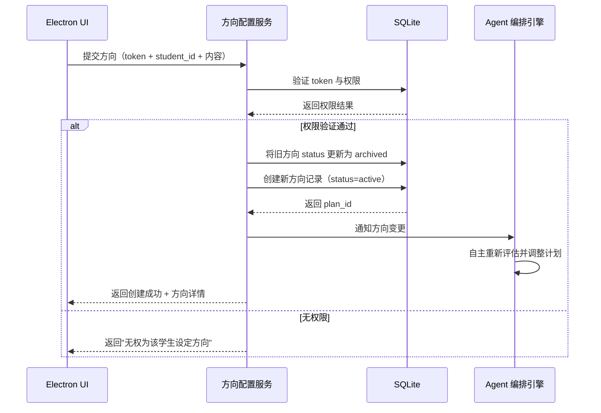

**接口需求**

- 参数验证：plan_title 不可为空；subjects 至少包含一个科目；描述内容可为自然语言（如"本学期重点突破函数和几何"）
- 业务规则：同一服务人同一时间只能有一份 active 状态方向；创建新方向时自动归档旧方向；方向内容可以是自然语言描述，Agent 自行理解和拆解

**接口实现逻辑**

- 权限校验：验证操作者是否为该 student_id 的监护人（或 self-guardian）
- 数据处理：UPDATE 旧方向 status=archived → INSERT 新方向 status=active
- 通知 Agent：触发 Agent 重新读取方向，Agent 自主决定如何调整后续安排
- 创建成功：返回 plan_id、标题、科目、方向描述、创建时间

#### 5.2.2 查询当前生效方向

**接口定义**

- 获取当前方向
- 接口（IPC 通道）：`plan:getActive`
- 返回指定服务人当前 status=active 的学习方向

**接口需求**

- 参数验证：token 有效；student_id 存在
- 业务规则：只返回 status=active 的方向；无方向时 Agent 进入通用模式，基于纯学习数据自主运行

**接口实现逻辑**

- 查询 Plan 表：WHERE student_id=? AND status='active'
- 无数据：返回 null，前端提示"暂未设定学习方向，Agent 将以通用模式运行"
- 有数据：返回方向详情

---

### 5.3 Bot 管理模块

> PersonalAC 支持所有 OpenClaw 兼容的 Bot。Bot 在本系统中承担的核心职责是**角色间通信**——监护人、教师、学生之间通过各自习惯使用的即时通讯平台（微信、Telegram、WhatsApp 等）与 Agent 和彼此交互。

#### 5.3.1 安装 Bot

**接口定义**

- 安装 Bot
- 接口（IPC 通道）：`bot:install`
- 管理员（监护人 / self-guardian）安装一个 Bot 并完成平台授权配置

**接口时序图**

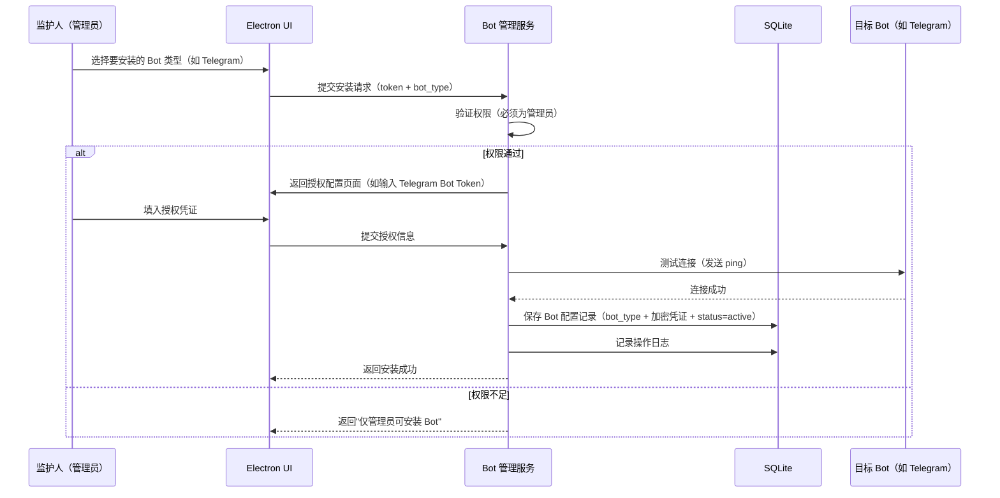

**接口需求**

- 参数验证：bot_type 必须为系统支持的 Bot 类型；授权凭证不可为空
- 安全要求：Bot 授权凭证（如 Token、API Key）使用 Electron safeStorage 加密存储；仅管理员（监护人 / self-guardian）可安装和卸载 Bot
- 业务规则：同一 bot_type 只能安装一个实例；安装前必须测试连接成功

**接口实现逻辑**

- 权限校验：验证当前用户角色为 guardian 或 self-guardian
- 授权验证：调用目标 Bot 平台 API 验证凭证有效性
- 加密存储：使用 Electron safeStorage 加密凭证后写入配置文件
- 写入 DB：保存 BotConfig 记录（bot_type、display_name、status、installed_by、install_time）
- 启动 Bot：初始化 Bot 连接，开始监听消息

#### 5.3.2 配置 Bot 与角色的绑定

**接口定义**

- 配置角色的 Bot 绑定
- 接口（IPC 通道）：`bot:bindUser`
- 将某个角色用户绑定到特定 Bot 的特定账号（如监护人绑定到微信 Bot 的某个微信号）

**接口需求**

- 管理员可以为所有角色配置 Bot 绑定
- 每个用户可以绑定多个 Bot（如监护人同时绑定了微信和 Telegram）
- Agent 向某角色发消息时，通过该角色绑定的所有 Bot 发送

**接口实现逻辑**

- 验证管理员权限
- 写入 BotUserBinding 表（user_id + bot_config_id + platform_user_id + bind_time）
- Agent 发消息时查询目标用户的所有绑定，逐一通过对应 Bot 发送

#### 5.3.3 Bot 消息收发

**接口定义**

- 收发消息
- 内部接口（由 Bot 消息路由层处理）
- Bot 接收到外部消息后路由到 Agent，Agent 处理后通过 Bot 回复

**接口时序图**

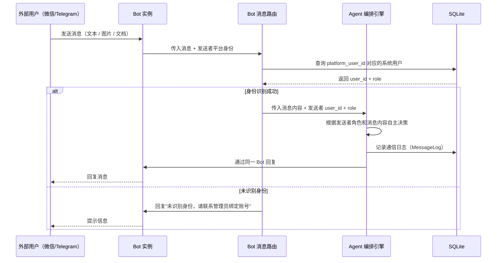

**接口需求**

- 支持的消息类型：文本、图片、文档（PDF/Word/Excel）、语音（转文字后处理）
- 收到多模态消息时，Agent 自动调用多模态处理流程
- 所有收发消息记录写入 MessageLog 表

---

### 5.4 资源管理模块

#### 5.4.1 教师上传资源

**接口定义**

- 上传学习资源
- 接口（IPC 通道）：`resource:upload`
- 教师选择本地文件，系统将其存入 Agent Workspace 并入库

**接口时序图**

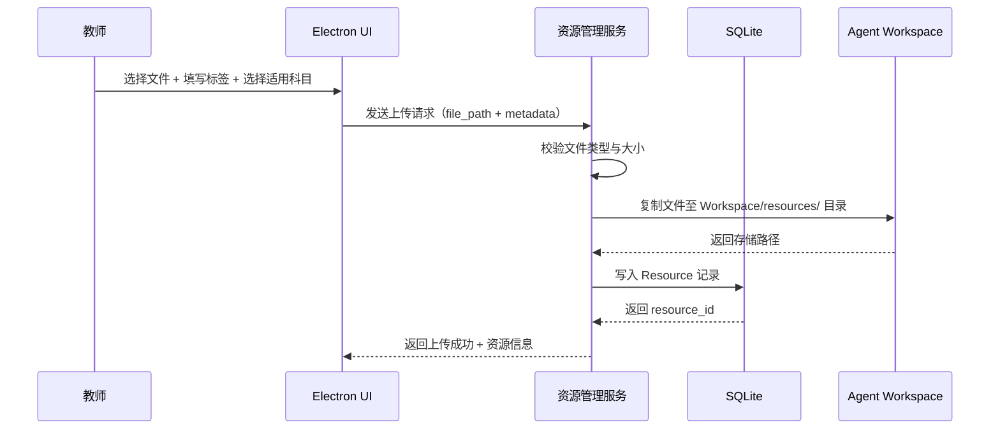

**接口需求**

- 参数验证：文件不可为空；支持的文件类型包括但不限于：pdf、docx、xlsx、jpg、png、mp4、mp3、txt、md（Agent 的多模态能力可以处理所有这些格式）；单文件最大 200MB
- 业务规则：教师角色才可上传；同名文件自动在文件名后缀加时间戳避免覆盖；资源上传后 Agent 自动感知并评估其与当前学习方向的相关性

**接口实现逻辑**

- 权限校验：验证 token 角色为 teacher
- 文件校验：校验扩展名白名单；校验文件大小
- 文件存储：使用 fs.copyFile 将源文件复制到 Workspace/resources/{teacher_id}/{timestamp}_{filename}
- 数据库写入：保存 resource_id、file_name、file_path、file_type、subject、teacher_id、create_time
- 通知 Agent：Agent 自主决定是否以及何时将资源纳入学习计划

#### 5.4.2 获取资源列表

**接口定义**

- 获取资源列表
- 接口（IPC 通道）：`resource:list`
- 返回当前用户有权查看的资源列表

**接口需求**

- 支持按 subject、file_type 筛选
- 按 create_time 倒序返回
- 分页：每页 20 条（offset + limit）

**接口实现逻辑**

- 教师角色：WHERE teacher_id=? AND delete_flag=0
- 服务人/监护人角色：WHERE delete_flag=0（可查看所有已上传资源）
- 返回字段：resource_id、file_name、file_type、subject、create_time、teacher_name

---

### 5.5 学习数据采集模块

#### 5.5.1 记录学习行为

**接口定义**

- 记录学习行为
- 接口（IPC 通道）：`data:recordLearning`
- 服务人完成一次练习或学习单元后，系统记录本次学习行为数据；也可由 Agent 解析多模态输入后自动写入

**接口时序图**

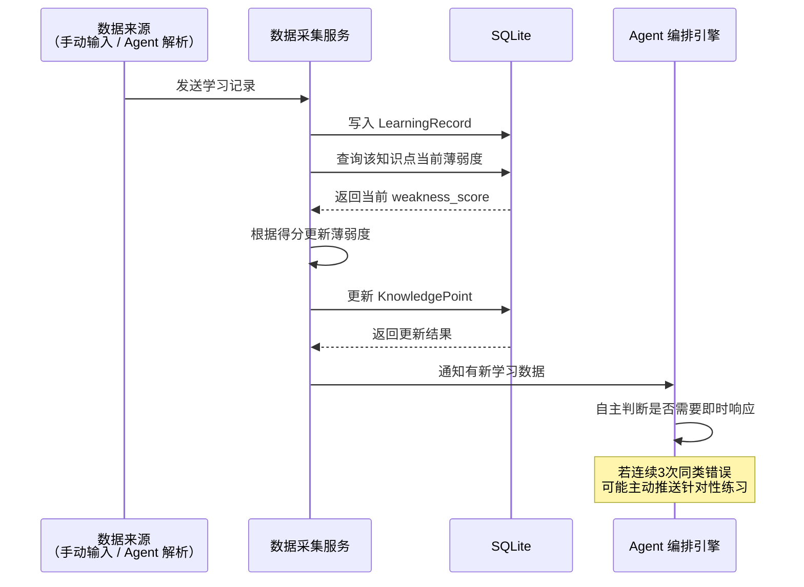

**接口需求**

- 参数验证：question_id、subject、score（0~100）、duration_seconds 均必填
- 业务规则：Agent 根据数据趋势自主决定响应——这不是固定阈值触发，而是 Agent 综合判断

**接口实现逻辑**

- 写入 LearningRecord：question_id、subject、score、duration_seconds、user_id、answered_at、source（manual / agent_parsed）
- 更新 KnowledgePoint：查找该知识点记录，更新 weakness_score 和 last_answered_at
- 若知识点记录不存在，自动创建
- 通知 Agent：Agent 收到新数据后自主判断是否需要采取行动

#### 5.5.2 查询学习统计数据

**接口定义**

- 查询学习统计
- 接口（IPC 通道）：`data:getSummary`
- 返回指定时间范围内的学习统计数据，供 Agent 构建 Prompt 和前端数据面板使用

**接口需求**

- 参数：student_id、date_from、date_to、subject（可选）
- 返回内容：总学习时长、平均得分、各科目作答次数、薄弱知识点列表
- 权限：服务人只能查自己；监护人可查其绑定的服务人；教师可查所有

---

### 5.6 Agent 核心模块

#### 5.6.1 Agent 自主编排引擎

Agent 编排引擎是整个系统的核心。它不是一个被调用的服务，而是一个**持续运行的决策主体**。

**运行机制**

Agent 在 Electron 主进程中持续运行，通过以下方式感知环境并决策：

- **事件驱动**：新数据写入（学习记录、资源上传）、Bot 消息到达、方向变更等事件触发 Agent 评估
- **定时唤醒**：Agent 可以给自己设定 cron 任务（如"每天 20:00 生成学习报告"、"明早 8:00 推送练习题"）
- **上下文感知**：Agent 维护一个上下文窗口，包含最近的学习数据、方向、历史建议、通信记录等

**Prompt 构建策略**

Agent 每次需要调用 AI 时，自主构建 Prompt。Prompt 由以下部分组成：

- **系统角色**：你是一位个性化学习助手，负责为学生提供自适应的学习辅导
- **学习方向**（如有）：监护人设定的大方向描述
- **学习数据摘要**：最近 N 天的学习统计、薄弱知识点
- **可用资源**：Workspace 中与当前方向相关的资源列表
- **历史上下文**：最近 N 条 Agent 建议和通信记录
- **当前任务**：Agent 自主判断的当前应执行的动作描述

Agent 自主决定 Prompt 的内容组合和侧重点——例如在发现某知识点连续失分时，会自动加重该知识点在 Prompt 中的权重。

#### 5.6.2 定时唤醒管理

**接口定义**

- Agent 自设定时唤醒
- 内部接口（Agent 自主调用）
- Agent 可以为自己创建、修改、删除定时任务

**运行机制**

- Agent 通过 node-cron 注册定时任务
- 每个任务包含：cron 表达式、任务描述、关联的 student_id
- Agent 可以根据学习进展动态调整唤醒频率和时间
- 应用最小化到托盘时，定时任务仍可执行
- 应用重启后，从 DB 中恢复所有活跃的定时任务
- 系统休眠恢复后，检查并补偿错过的任务

**数据存储**

- ScheduleConfig 表：cron_expression、description、student_id、is_active、created_by_agent（标记为 Agent 自建）
- 每次触发均写入 AgentLog

#### 5.6.3 多模态输入处理

**支持的输入格式**

Agent 支持接收和理解以下格式的输入，无论是通过 Electron UI 直接上传还是通过 Bot 发送：

- **图片**：jpg、png、gif、webp——可识别试卷、笔记、截图等内容
- **文档**：pdf、docx、xlsx、pptx、txt、md——可提取并理解文本内容
- **音频**（通过 Bot 接收）：语音消息转文字后处理
- **纯文本**：自然语言对话

**处理流程**

1. 接收文件，识别文件类型
2. 将原始文件保存到 Agent Workspace
3. 根据文件类型选择处理方式：
   - 图片/PDF → 通过模型的多模态能力直接理解
   - 文档 → 提取文本后作为上下文传入模型
   - 音频 → 转文字后作为文本处理
4. 模型返回结构化理解结果
5. Agent 根据结果自主决定后续动作（写入学习记录、更新薄弱点、推送建议等）

---

### 5.7 AI 模型配置模块

#### 5.7.1 模型发现与选择

**接口定义**

- 获取可用模型列表
- 接口（IPC 通道）：`settings:getModels`
- 从 models.dev API 获取当前可用的 AI 模型列表，展示给用户选择

**接口实现逻辑**

- 调用 models.dev API（`https://models.dev/api.json`）获取完整模型列表
- 筛选支持多模态输入（text + image）的模型
- 展示模型名称、提供商、价格、能力（是否支持 tool call / reasoning / image input）
- 用户选择后保存到本地配置

#### 5.7.2 配置 API Key

**接口定义**

- 保存 AI 配置
- 接口（IPC 通道）：`settings:saveAIConfig`
- 用户选择模型提供商后，输入对应的 API Key

**接口需求**

- 参数验证：api_key 不可为空；provider 必须为 models.dev 中存在的提供商
- 安全要求：API Key 使用 Electron safeStorage 加密存储；界面仅展示 Key 的前 4 位和后 4 位

**接口实现逻辑**

- 根据 models.dev 中的 provider 信息，调用对应提供商 API 验证 Key 有效性
- 验证通过后加密存储
- 保存 provider_id、model_id、model_display_name 至 SQLite Settings 表
- 异常处理：Key 无效返回"API Key 验证失败"；网络不可用返回"无法验证，请检查网络"

---

### 5.8 Agent Workspace 模块

#### 5.8.1 Workspace 结构

Agent Workspace 是 Agent 的专属本地工作空间，位于应用数据目录下。Agent 可以在其中自由读写文件。

**目录结构**

```
{AppData}/personalac/workspace/
├── resources/              # 教师上传的学习资源
│   └── {teacher_id}/
│       └── {timestamp}_{filename}
├── generated/              # Agent 生成的内容（建议、练习题、报告等）
│   └── {student_id}/
│       └── {date}/
├── uploads/                # 用户/Bot 上传的多模态文件（试卷照片等）
│   └── {student_id}/
│       └── {timestamp}_{filename}
└── temp/                   # 临时文件（处理中间产物）
```

#### 5.8.2 Workspace 操作接口

**接口定义**

- 文件读写操作
- 内部接口（Agent 和各服务模块调用）

**支持的操作**

- `workspace:write` — 写入文件到指定子目录
- `workspace:read` — 读取文件内容
- `workspace:list` — 列出指定目录下的文件
- `workspace:delete` — 删除文件（需权限验证）
- `workspace:getStats` — 获取 Workspace 总占用大小

**业务规则**

- Agent 可自由读写 generated/ 和 temp/ 目录
- resources/ 目录仅由资源管理模块写入
- uploads/ 目录由多模态处理流程写入
- 磁盘占用超过 5GB 时提醒用户清理

---

## 六、数据模型（Data Model）

> 所有表均包含 ccuud 五大基础字段：`create_user`、`update_user`、`create_time`、`update_time`、`delete_flag`

### 6.1 User（用户表）

| 字段名 | 类型 | 说明 |
|---|---|---|
| id | INTEGER PRIMARY KEY | 用户 ID，自增 |
| username | VARCHAR(50) | 用户名，唯一 |
| password_hash | TEXT | bcrypt 加密后的密码 |
| role | VARCHAR(20) | 角色：student / guardian / teacher |
| guardian_id | INTEGER | 绑定的监护人 user_id（student 专用） |
| is_self_guardian | INTEGER | 1=自身为监护人，0=否 |
| last_login_time | DATETIME | 最后登录时间 |
| create_user / update_user / create_time / update_time / delete_flag | — | ccuud 基础字段 |

### 6.2 Session（会话表）

| 字段名 | 类型 | 说明 |
|---|---|---|
| id | INTEGER PRIMARY KEY | 会话 ID |
| user_id | INTEGER | 关联 User.id |
| token | VARCHAR(100) | UUID v4 session token |
| expired_at | DATETIME | 过期时间 |
| create_time | DATETIME | 创建时间 |

### 6.3 Plan（学习方向表）

| 字段名 | 类型 | 说明 |
|---|---|---|
| id | INTEGER PRIMARY KEY | 方向 ID |
| student_id | INTEGER | 关联服务人 User.id |
| guardian_id | INTEGER | 设定方向的监护人 User.id |
| plan_title | VARCHAR(200) | 方向标题 |
| plan_description | TEXT | 方向描述（自然语言，Agent 自行理解） |
| subjects | TEXT | 科目列表（JSON 数组） |
| status | VARCHAR(20) | active / archived |
| create_user / update_user / create_time / update_time / delete_flag | — | ccuud 基础字段 |

### 6.4 Resource（学习资源表）

| 字段名 | 类型 | 说明 |
|---|---|---|
| id | INTEGER PRIMARY KEY | 资源 ID |
| teacher_id | INTEGER | 上传教师 User.id |
| file_name | VARCHAR(200) | 原始文件名 |
| file_path | TEXT | Workspace 内存储路径 |
| file_type | VARCHAR(20) | pdf / docx / jpg / png / mp4 等 |
| subject | VARCHAR(50) | 适用科目 |
| create_user / update_user / create_time / update_time / delete_flag | — | ccuud 基础字段 |

### 6.5 LearningRecord（学习行为记录表）

| 字段名 | 类型 | 说明 |
|---|---|---|
| id | INTEGER PRIMARY KEY | 记录 ID |
| student_id | INTEGER | 关联服务人 User.id |
| question_id | VARCHAR(100) | 题目标识 |
| subject | VARCHAR(50) | 科目 |
| knowledge_point | VARCHAR(200) | 知识点名称 |
| score | INTEGER | 得分（0~100） |
| duration_seconds | INTEGER | 作答用时（秒） |
| source | VARCHAR(20) | 数据来源：manual / agent_parsed / bot_received |
| answered_at | DATETIME | 作答时间 |
| create_user / update_user / create_time / update_time / delete_flag | — | ccuud 基础字段 |

### 6.6 KnowledgePoint（知识点薄弱度表）

| 字段名 | 类型 | 说明 |
|---|---|---|
| id | INTEGER PRIMARY KEY | 记录 ID |
| student_id | INTEGER | 关联服务人 User.id |
| subject | VARCHAR(50) | 科目 |
| point_name | VARCHAR(200) | 知识点名称 |
| weakness_score | INTEGER | 薄弱度分值（越高越弱，Agent 参考用） |
| last_answered_at | DATETIME | 最后作答时间 |
| create_user / update_user / create_time / update_time / delete_flag | — | ccuud 基础字段 |

### 6.7 AgentLog（Agent 行为日志表）

| 字段名 | 类型 | 说明 |
|---|---|---|
| id | INTEGER PRIMARY KEY | 日志 ID |
| student_id | INTEGER | 关联服务人 User.id |
| action_type | VARCHAR(50) | 行为类型：advice / schedule_set / plan_adjust / report_send / resource_evaluate 等 |
| action_detail | TEXT | 行为详情（JSON 格式，记录 Agent 的具体决策和输出） |
| trigger_type | VARCHAR(20) | scheduled / event / manual / bot_message |
| model_used | VARCHAR(100) | 使用的 AI 模型 ID |
| triggered_at | DATETIME | 触发时间 |
| create_user / update_user / create_time / update_time / delete_flag | — | ccuud 基础字段 |

### 6.8 ScheduleConfig（Agent 定时配置表）

| 字段名 | 类型 | 说明 |
|---|---|---|
| id | INTEGER PRIMARY KEY | 配置 ID |
| student_id | INTEGER | 关联服务人 User.id |
| cron_expression | VARCHAR(50) | Cron 表达式（如 `0 20 * * *`） |
| description | TEXT | 任务描述（Agent 自行填写） |
| is_active | INTEGER | 1=启用，0=停用 |
| created_by_agent | INTEGER | 1=Agent 自建，0=用户手动创建 |
| last_triggered_at | DATETIME | 上次触发时间（用于补偿机制） |
| create_user / update_user / create_time / update_time / delete_flag | — | ccuud 基础字段 |

### 6.9 BotConfig（Bot 配置表）

| 字段名 | 类型 | 说明 |
|---|---|---|
| id | INTEGER PRIMARY KEY | 配置 ID |
| bot_type | VARCHAR(50) | Bot 类型：wechat / telegram / whatsapp / discord / signal 等 |
| display_name | VARCHAR(100) | 展示名称 |
| credential_ref | VARCHAR(200) | 加密凭证引用（指向 safeStorage 中的 key） |
| status | VARCHAR(20) | active / inactive / error |
| installed_by | INTEGER | 安装者 User.id |
| install_time | DATETIME | 安装时间 |
| create_user / update_user / create_time / update_time / delete_flag | — | ccuud 基础字段 |

### 6.10 BotUserBinding（Bot 用户绑定表）

| 字段名 | 类型 | 说明 |
|---|---|---|
| id | INTEGER PRIMARY KEY | 绑定 ID |
| user_id | INTEGER | 系统用户 User.id |
| bot_config_id | INTEGER | 关联 BotConfig.id |
| platform_user_id | VARCHAR(200) | 平台侧用户标识（如微信 openid、Telegram chat_id） |
| bind_time | DATETIME | 绑定时间 |
| create_user / update_user / create_time / update_time / delete_flag | — | ccuud 基础字段 |

### 6.11 MessageLog（通信日志表）

| 字段名 | 类型 | 说明 |
|---|---|---|
| id | INTEGER PRIMARY KEY | 日志 ID |
| sender_user_id | INTEGER | 发送者 User.id（系统用户；Agent 发送时为 0） |
| receiver_user_id | INTEGER | 接收者 User.id |
| bot_config_id | INTEGER | 通过哪个 Bot 发送/接收 |
| direction | VARCHAR(10) | inbound（外部→系统）/ outbound（系统→外部） |
| message_type | VARCHAR(20) | text / image / document / audio |
| message_content | TEXT | 消息内容（文本内容或文件路径） |
| sent_at | DATETIME | 发送/接收时间 |
| create_user / update_user / create_time / update_time / delete_flag | — | ccuud 基础字段 |

---

## 七、性能考量（Performance Considerations）

### 7.1 AI 调用延迟

**问题**

通过模型提供商 API 调用 LLM 生成建议，通常耗时 3~15 秒，定时唤醒和 Bot 消息场景下延迟感知尤为明显。

**解决方案**

- **前端 loading 状态**：主动触发时立即展示加载动画，定时触发时 Agent 在通知中注明"正在为你准备建议"
- **Bot 场景先回复再处理**：Bot 收到消息后立即回复"收到，正在处理..."，AI 生成完毕后再发送结果
- **上下文缓存**：Agent 维护一个上下文缓存，避免每次调用 AI 都重新构建完整上下文
- **超时保护**：设置 30 秒超时，超时后返回历史建议并通知用户稍后重试

### 7.2 本地 SQLite 查询性能

**问题**

LearningRecord、AgentLog、MessageLog 随时间积累数据量增大，全表扫描可能变慢。

**解决方案**

- **索引优化**：LearningRecord 的 `(student_id, answered_at)` 复合索引；KnowledgePoint 的 `(student_id, weakness_score)` 索引；MessageLog 的 `(sender_user_id, sent_at)` 索引
- **数据归档**：超过 1 年的 LearningRecord 和 MessageLog 移入归档表
- **分页查询**：所有列表接口强制分页，禁止全量返回

### 7.3 定时任务稳定性

**问题**

Electron 应用在后台最小化或系统休眠后，node-cron 可能错过触发时间。

**解决方案**

- **补偿机制**：应用启动和系统唤醒时，检查每个 ScheduleConfig 的 last_triggered_at，补偿错过的任务
- **系统唤醒监听**：监听 Electron 的 `powerMonitor.resume` 事件
- **触发日志**：每次触发（含补偿）写入 AgentLog，便于追溯

### 7.4 Bot 消息并发

**问题**

多个 Bot 同时接收消息时可能产生并发处理压力。

**解决方案**

- **消息队列**：Bot 收到的消息统一进入内存队列，Agent 按序处理
- **去重机制**：同一用户在 5 秒内的重复消息自动去重
- **Bot 健康检查**：每 5 分钟检查各 Bot 连接状态，异常时自动重连并记录日志

### 7.5 Workspace 磁盘管理

**问题**

资源文件和 Agent 生成内容持续积累，占用本地磁盘。

**解决方案**

- **上传限制**：单文件最大 200MB
- **容量监控**：Workspace 总占用超过 5GB 时提示用户清理
- **temp 目录自动清理**：超过 7 天的临时文件自动删除
- **软删除延迟清理**：资源标记 delete_flag=1 后保留 30 天再清理物理文件

---

## 八、风险分析（Risk Analysis）

### 8.1 产品风险

**Agent 自主行为越界**

**风险描述**：Agent 拥有较高的自主编排权限，可能做出超出用户预期的行为——例如频繁推送打扰用户，或者在不恰当的时机通过 Bot 发送消息。

**对策**：
- Agent 的自主权限限制在明确的边界内：可以自行调整学习节奏、设定唤醒时间、推送建议，但不可更改学习方向、安装 Bot、删除数据
- 所有 Agent 行为写入 AgentLog，用户和监护人可以随时查阅
- 提供"免打扰时段"配置，Agent 在该时段内不主动推送
- Agent 通过 Bot 发送的消息频率上限：每人每小时不超过 5 条

**AI 建议质量不稳定**

**风险描述**：不同模型生成的学习建议质量参差不齐，可能产生误导性内容。

**对策**：
- 建议内容末尾固定附加声明："以上建议由 AI 生成，仅供参考"
- Agent 构建 Prompt 时使用标准化的角色定义和约束条件
- 通过 AgentLog 中记录的用户反馈（有用/没用标记）持续优化 Prompt 策略

### 8.2 技术风险

**Bot 连接不稳定**

**风险描述**：外部 Bot 平台（微信、Telegram 等）可能出现连接中断、API 变更或账号封禁风险。

**对策**：
- Bot 连接采用自动重连机制，断连后每 30 秒重试，最多重试 10 次
- 支持同一用户绑定多个 Bot，单个 Bot 不可用时其他渠道仍可通信
- Bot 状态在 UI 面板实时展示，异常时醒目提示管理员
- Bot 发送失败的消息暂存到队列，恢复后自动重发

**模型提供商 API 不可用**

**风险描述**：AI 服务出现故障或网络不可达，Agent 核心的建议生成能力失效。

**对策**：
- 设置 30 秒超时，超时后降级返回最近一次历史建议
- 用户可在设置中配置多个模型提供商和 API Key，Agent 自动切换备用模型
- 完全离线状态下，Agent 仍可执行定时唤醒、记录数据、通过已缓存的上下文给出基础建议

**SQLite 数据损坏**

**风险描述**：设备异常断电或程序崩溃可能导致 SQLite 数据库文件损坏。

**对策**：
- 所有写操作使用事务（BEGIN TRANSACTION），保证原子性
- 应用每周自动备份数据库文件至 backup/ 子目录，保留最近 3 份
- 启动时执行 `PRAGMA integrity_check` 检验完整性，损坏时引导用户从备份恢复

### 8.3 安全风险

**用户数据隐私**

**风险描述**：学生的学习数据属于敏感个人信息；Bot 通信内容可能包含私人对话。

**对策**：
- 所有数据完全存储在本地 SQLite 和 Workspace，不上传至任何云端
- AI 调用时仅传入聚合统计数据（如"数学平均分65分，薄弱点：函数"），不传入完整原始数据
- API Key 和 Bot 凭证使用 Electron safeStorage 加密存储
- Bot 通信内容仅记录日志用于 Agent 上下文，不对外传输

**Bot 凭证泄露**

**风险描述**：Bot 授权凭证若泄露，外部攻击者可能冒充系统发送消息。

**对策**：
- 凭证使用操作系统级加密（Electron safeStorage，底层依赖 macOS Keychain / Windows Credential Manager / Linux libsecret）
- Bot 凭证仅管理员可查看和修改，且界面仅展示脱敏信息
- 定期提醒管理员更换 Bot Token

### 8.4 开源社区风险

**代码贡献质量**

**风险描述**：开源项目接受外部贡献，可能引入低质量代码或安全漏洞。

**对策**：
- 制定 CONTRIBUTING.md，明确代码规范、PR 流程与 Review 要求
- 启用 GitHub Actions 自动化测试，PR 合并前必须通过测试与 lint
- 敏感模块（认证、Bot 管理、Agent 核心）的改动需 2 位 maintainer Review

**第三方 Bot 兼容性**

**风险描述**：OpenClaw 兼容的 Bot 生态持续演化，部分 Bot 的 API 可能发生破坏性变更。

**对策**：
- Bot 通信层采用适配器模式（Adapter Pattern），每个 Bot 类型对应一个独立适配器
- 适配器更新不影响核心 Agent 逻辑
- 维护 Bot 兼容性矩阵文档，记录各 Bot 的测试状态和已知问题
