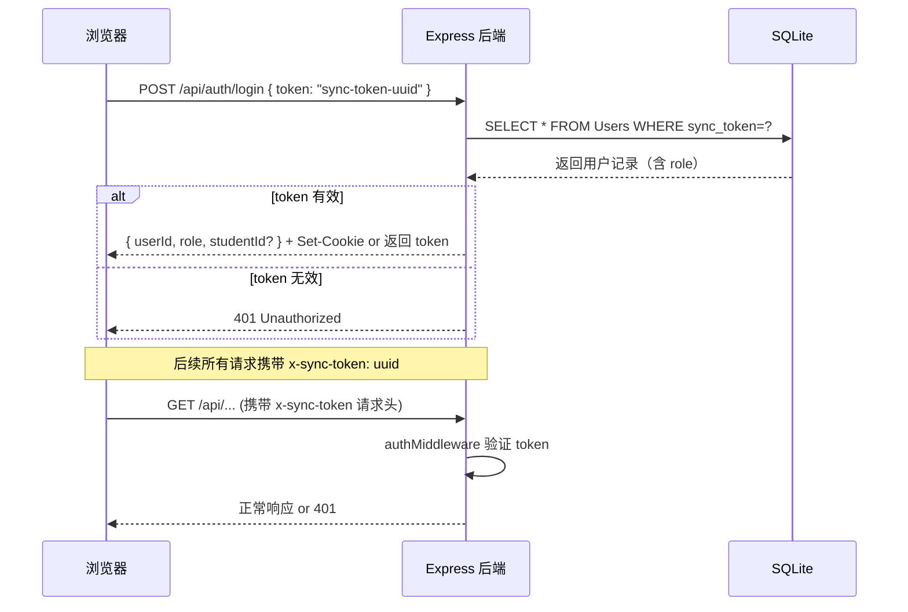
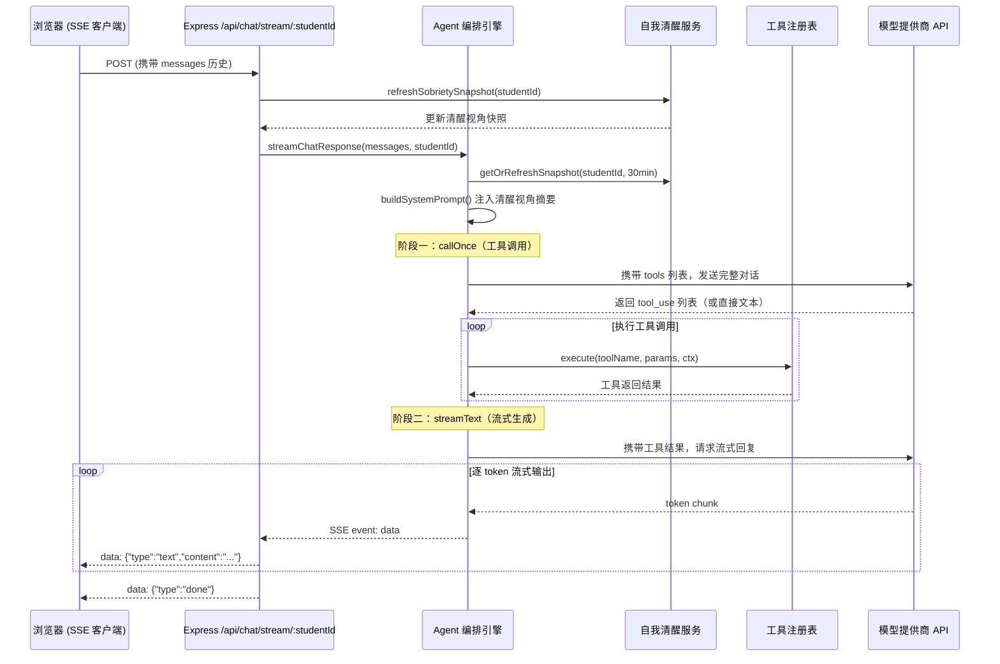
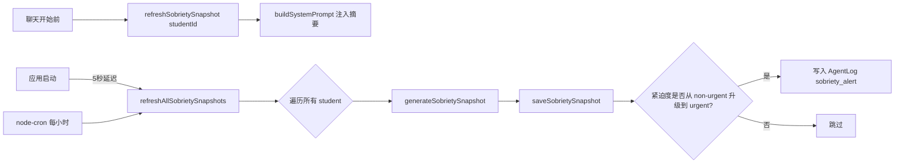
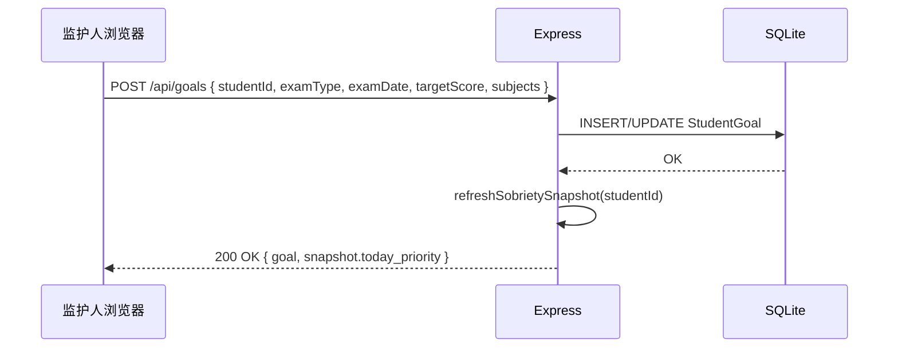
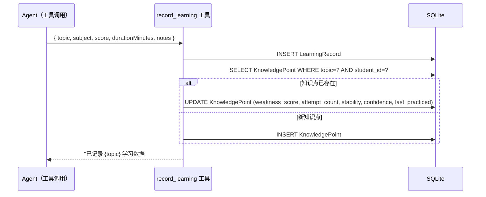

# PersonalAC 技术设计文档（综合版 v1.3）

> 本文档整合了 1.0 原始设计、1.1～1.3 版本变更清单，以及 1.3 开发过程中的全部会话级修改。
> 所有已废弃的历史设计保留于「历史沿革」小节中供参考；当前状态以正文为准。

---

## 一、需求概述（Requirement Overview）

### 1.1 项目目标

PersonalAC 是一个面向学生的**个性化学习辅助系统**，属于开源项目，完全本地部署，数据不出用户设备。

系统以**自主 Agent** 为核心。Agent 不是固定的工作流执行器，而是具备自主编排能力的智能体——用户（或监护人）设定学习大方向和考试目标，Agent 在范围内自由决定何时采集数据、何时推送建议、以何种方式回应用户，实现真正的**个性化学习陪伴**。

**v1.3 技术栈**：**Web 服务**（Node.js Express 后端 + React/Vite 前端）+ **SQLite 本地数据库** + **models.dev 模型注册中心**（动态获取可用 AI 模型列表，实际调用走各提供商 API：Anthropic、OpenAI、Google 等）。

> **历史沿革**：1.0 使用 Electron 桌面应用；1.3 抛弃 Electron，转向轻量级 Web Server（前端静态文件由 Express 托管，后端 REST + SSE API）。

### 1.2 核心价值

- **学生（Student）**：获得个性化的、主动的学习陪伴——Agent 主动观察、主动推送、主动调整，而非被动等待提问；AI 从第一句话就掌握"清醒视角"（考试倒计时、待复习知识点、持续卡点等）
- **监护人（Guardian）**：设定学习大方向和考试目标后即可放手，Agent 代为跟进落地；可随时通过 Web 界面查看学生进展，工作量大幅降低
- **Agent**：持续维护对学生状态的"自我清醒"快照，在每次会话开始前注入 system prompt，使对话从第一句话就切中要害

### 1.3 非目标范围

- 不提供云端数据同步（数据完全存储于本地服务器，配置通过 Settings 表统一管理）
- 不替代正式教学管理系统（如学校 OA、教务系统）
- 不自动向外网发送学生隐私数据
- 不提供在线多人实时协作功能
- 不支持教师角色（1.1 版本已移除）

---

## 二、业务场景

### 用户角色

| 角色 | 说明 | 权限 |
|---|---|---|
| **监护人（Guardian）** | 管理员角色 | 创建学生账户、设定学习方向和考试目标、查看所有学生数据、配置 AI 模型和 API Key、管理系统设置 |
| **学生（Student）** | 核心用户 | 通过 Web 聊天界面与 Agent 交互、记录学习数据、查看个人建议、查看自己的统计数据 |

> **角色说明**：1.0/1.1 版本中存在"服务人 / 监护人 / 教师"三角色；1.1 移除教师；1.2 移除所有角色（SuperAdmin）；1.3 重新引入极简双角色：监护人（guardian）和学生（student），通过唯一 Sync Token 区分。

### 场景描述

- 学生打开 Web 聊天界面，AI 从第一句话起就知晓"距高考还有87天、函数题保留率只有34%、上次没理清等差数列"，主动引导今日复习
- 监护人在 Config 页面填入考试类型（高考）和日期，系统自动计算倒计时并注入到每次 AI 会话
- 学生上传一张试卷照片，Agent 识别题目、标注错题知识点、更新薄弱度，并立即给出针对性讲解
- 监护人为学生配置 Anthropic Claude 模型；学生自己的聊天会话自动继承此配置，无需二次设置
- 系统每小时自动刷新"清醒视角"快照，当紧迫度从 attention 升级到 urgent 时，写入告警日志
- 学生通过两栏式模型选择器（左：Provider / 右：Model）切换不同 AI 模型，每栏独立搜索

### 用户目标

- 学生可以在无额外监督下，获得持续的、个性化的、主动的学习路径引导
- 监护人通过简洁 Web 界面低成本地了解和干预学生的学习节奏
- Agent 自主维护学生状态感知，对话始终从"当前最紧迫"切入，而非等待用户说明情况

---

## 三、系统架构设计

### 3.1 架构设计原则

系统采用**分层 Web 架构**，运行在用户本地服务器（或个人电脑）上，核心目标：

- 职责清晰，前后端分离
- Agent 自主性优先——架构围绕 Agent 的决策自由度设计
- 完全离线可用（AI API 调用除外）
- 轻量化，适配低配置服务器（1 Core / 1GB RAM 可运行）
- 易于开源社区扩展和 npm 安装使用

### 3.2 系统整体架构

```
┌─────────────────────────────────────────────────────────────────┐
│                        客户端浏览器                              │
│   React + Vite + TypeScript                                     │
│   ├── 聊天界面 (Chat)  — SSE 实时流式响应                        │
│   ├── 配置界面 (Config) — AI 模型 / API Key / 学生管理          │
│   └── 登录页 (Login)   — Sync Token 认证                        │
└─────────────────────┬──────────────────────────────────────────┘
                      │  HTTP / SSE
┌─────────────────────▼──────────────────────────────────────────┐
│                    Express 后端（端口 3000）                     │
│                                                                 │
│  ┌──────────────┐  ┌──────────────┐  ┌───────────────────────┐ │
│  │ 认证中间件    │  │ REST 路由     │  │ SSE 流式聊天端点       │ │
│  │ x-sync-token │  │ /api/...     │  │ /api/chat/stream/:id  │ │
│  └──────────────┘  └──────────────┘  └───────────────────────┘ │
│                                                                 │
│  ┌──────────────────────────────────────────────────────────┐  │
│  │                   Agent 核心层                            │  │
│  │  ┌─────────────────┐  ┌──────────────────────────────┐  │  │
│  │  │  自我清醒服务     │  │  ReAct 编排引擎               │  │  │
│  │  │  SobrietyService│  │  callOnce + streamText       │  │  │
│  │  └─────────────────┘  └──────────────────────────────┘  │  │
│  │  ┌─────────────────┐  ┌──────────────────────────────┐  │  │
│  │  │  工具注册表       │  │  系统 Prompt 构建器           │  │  │
│  │  │  ToolRegistry   │  │  buildSystemPrompt()         │  │  │
│  │  └─────────────────┘  └──────────────────────────────┘  │  │
│  └──────────────────────────────────────────────────────────┘  │
│                                                                 │
│  ┌──────────────┐  ┌──────────────┐  ┌───────────────────────┐ │
│  │ 定时任务      │  │ Workspace 服务│  │  node-cron 调度器      │ │
│  │ (node-cron)  │  │ ~/.personalac│  │  每小时刷新清醒快照     │ │
│  └──────────────┘  └──────────────┘  └───────────────────────┘ │
└─────────────────────┬──────────────────────────────────────────┘
                      │
┌─────────────────────▼──────────────────────────────────────────┐
│                       数据层                                    │
│   SQLite（better-sqlite3）                                      │
│   ~/.personalac/personalac.db                                   │
│                                                                 │
│   Workspace 文件系统                                             │
│   ~/.personalac/workspace/                                      │
└─────────────────────────────────────────────────────────────────┘
                      │
┌─────────────────────▼──────────────────────────────────────────┐
│                   外部 AI 层                                    │
│   models.dev 模型注册中心（动态获取模型列表）                      │
│   各提供商 API：Anthropic SDK / OpenAI SDK / Google SDK 等      │
└─────────────────────────────────────────────────────────────────┘
```

### 3.3 技术选型说明

| 层次 | 技术选型 | 说明 |
|---|---|---|
| 后端框架 | Node.js + Express + TypeScript | 轻量 Web 服务器，REST API + SSE 流式响应 |
| 前端框架 | React 18 + Vite + TypeScript | 组件化 UI，热更新开发体验 |
| 本地数据库 | SQLite（better-sqlite3） | 零配置、单文件数据库，同步 API，适合本地部署 |
| ORM/查询 | 原生 SQL（better-sqlite3 prepare） | 不引入 ORM，保持查询可控 |
| Agent Workspace | 本地文件系统（~/.personalac/workspace/） | Agent 的专属工作空间，存放资源文件、临时文件、生成内容 |
| AI 模型发现 | models.dev API | 动态查询可用模型列表、能力、价格等元信息 |
| AI 模型调用 | Anthropic SDK / OpenAI SDK / @ai-sdk/google 等 | 根据用户选择的模型，调用对应提供商接口；支持 thinking（Anthropic）和 reasoning_effort（OpenAI） |
| 流式响应 | SSE（Server-Sent Events） | 聊天回复实时流式输出，前端逐 token 渲染 |
| 定时任务 | node-cron | 每小时刷新清醒视角快照，补偿遗漏任务 |
| 认证 | UUID Sync Token（x-sync-token 请求头） | 无密码，极简鉴权；token 存储于 Users 表 |
| 包分发 | npm（personalac@1.3.0） | `npx personalac` 一行启动，无需手动 clone |
| 全文检索 | SQLite FTS5 扩展 | Workspace 文件内容索引，支持关键字搜索 |

> **历史沿革**：1.0 使用 Electron IPC；1.3 改为标准 HTTP API，所有 IPC 通道对应替换为 REST 端点。

---

## 四、业务流程设计

### 4.1 认证流程（Sync Token）



**说明**：
- token 是一次性生成的 UUID，在监护人界面创建学生时随机生成
- 无用户名、无密码，token 本身即身份凭证
- 监护人 token 和学生 token 分别授权不同接口权限

### 4.2 聊天主流程（ReAct 两阶段）



**SSE 事件类型**：

| 事件 type | 含义 |
|---|---|
| `thinking` | AI 推理过程（仅 extended thinking / reasoning 模型） |
| `text` | 正文 token |
| `tool_use` | 工具调用开始（携带 name + input） |
| `tool_result` | 工具返回结果 |
| `done` | 流结束 |
| `error` | 出错 |

### 4.3 自我清醒刷新流程



**快照生成逻辑（纯 DB 计算，不调用 AI）**：

1. **距离考试天数**：查 StudentGoal 表 → `days_left = ceil((exam_date - now) / 86400000)`
2. **待复习知识点**：Ebbinghaus 遗忘曲线 `retention = e^(-days / max(stability × 5, 1))`，`retention < 0.5` 的知识点按保留率升序取前5
3. **持续卡点**：`attempt_count ≥ 3 AND confidence < 0.5`，按 attempt_count 倒序取前3
4. **学科漂移**：近14天分钟分布，考试 < 60 天且主修学科占比 ≥ 60% 时告警
5. **上次未解决悬念**：最近5条 explanation_log 中 `understood=false` 的最后一项
6. **紧迫度**：idle / normal / attention / urgent，由考试倒计时 + 离线天数 + 待复习数量综合决定
7. **today_priority**：以上信息压缩为 ≤ 400 字的中文摘要，注入 system prompt

### 4.4 监护人设定学习目标流程



### 4.5 学习记录与知识点更新流程



---

## 五、模块设计（Module Design）

### 5.1 认证与角色管理模块

#### 5.1.1 设计原则（1.3 版本）

1.3 版本采用极简 Sync Token 认证：
- 不存储密码，不需要注册流程
- 监护人账户在首次启动时由系统生成（或通过 CLI/配置文件指定）
- 学生账户由监护人在 Config 界面创建，系统自动生成 UUID Sync Token
- 所有 API 请求通过 `x-sync-token` 请求头鉴权

> **历史沿革**：
> - 1.0：username + bcrypt 密码，Session 表存 token，支持注册/登录/绑定
> - 1.1：同 1.0，但教师角色从 User.role 枚举中移除
> - 1.2：彻底移除所有认证，系统默认以 SuperAdmin 身份运行
> - 1.3：重新引入极简认证，以 Sync Token 替代 username/password

#### 5.1.2 接口列表

| 方法 | 路径 | 权限 | 说明 |
|---|---|---|---|
| POST | /api/auth/login | 公开 | Sync Token 登录，返回用户信息 |
| GET | /api/auth/me | 已登录 | 返回当前用户信息 |
| POST | /api/students | guardian | 创建学生账户，生成 Sync Token |
| GET | /api/students | guardian | 列出所有学生 |
| DELETE | /api/students/:id | guardian | 删除学生及其所有数据 |

#### 5.1.3 认证中间件

```typescript
// server/src/middleware/auth.ts
// 从 x-sync-token 请求头取 token → 查 Users 表 → 注入 req.user
```

---

### 5.2 学习方向配置模块（StudentGoal）

#### 5.2.1 功能说明

监护人通过 Config 界面为每个学生设定：
- 考试类型（exam_type）：如"高考"、"中考"、"托福"等自然语言字符串
- 考试日期（exam_date）：Unix 时间戳（毫秒）
- 目标分数（target_score）：可选
- 重点科目（subjects）：JSON 数组，如 `["数学", "英语"]`

每个学生只有一条活跃 Goal 记录（INSERT OR REPLACE 语义），Goal 更新后系统立即刷新清醒视角快照。

#### 5.2.2 接口列表

| 方法 | 路径 | 权限 | 说明 |
|---|---|---|---|
| GET | /api/goals/:studentId | guardian / student(自己) | 获取学生当前目标 |
| POST | /api/goals | guardian | 设置/更新学生目标 |
| DELETE | /api/goals/:studentId | guardian | 清除学生目标 |

> **历史沿革**：1.0 的 Plan 表（plan_title / plan_description / status 字段）在 1.3 重构为更精简的 StudentGoal 表，以考试日期为中心，配合 Ebbinghaus 曲线驱动复习调度。

---

### 5.3 Agent 核心模块

#### 5.3.1 ReAct 编排引擎

Agent 使用**两阶段 ReAct 模式**：

**阶段一：callOnce（工具调用）**
- 将完整对话历史 + 所有工具定义发送给 AI
- AI 返回零个或多个 tool_use 块
- 串行执行所有工具调用，收集结果

**阶段二：streamText（流式生成）**
- 将工具结果追加到对话历史
- 以 streaming=true 请求 AI 生成最终回复
- 逐 token 通过 SSE 推送到前端

此设计不是递归 ReAct（工具结果不会再触发新一轮工具调用），而是单次工具批处理 + 一次最终生成。

#### 5.3.2 系统 Prompt 构建（buildSystemPrompt）

**监护人 Prompt**（简洁版）：
```
你是 PersonalAC 学习助手，当前用户是监护人角色。
你可以帮助查看学生学习情况、设定目标和方向。
学生状态摘要：{snap.today_priority}
```

**学生 Prompt**（完整版）：
```
你是 PersonalAC 个性化学习助手。

清醒视角【{urgency_level}】：{snap.today_priority}

【清醒原则】：
- 你已知晓学生的当前状态，无需等待学生说明——从第一句话就主动切入最紧迫的问题
- 若有考试倒计时，在会话中自然地提及剩余天数以制造紧迫感
- 若有待复习知识点，优先围绕这些知识点展开对话
- 若有持续卡点，本次会话中尝试用新方法突破
- 若有上次未解决的悬念，首先追问是否已理清

【工具使用】：
在帮助学生学习时，主动使用 record_learning 工具记录学习数据，
使用 get_knowledge_points 了解知识点历史，
使用 get_sobriety 获取完整状态快照。
```

紧迫度标注规则：
- urgent → `【紧迫】`（红色含义）
- attention → `【关注】`
- normal / idle → 不标注

#### 5.3.3 推理模型支持

系统支持两类特殊推理模式：

**Anthropic Extended Thinking**（claude-3-7-sonnet 等）：
- 在 callOnce 阶段添加 `thinking: { type: 'enabled', budget_tokens: 8000 }`
- SSE 中 thinking 块以 `type: "thinking"` 事件单独推送

**OpenAI Reasoning**（o1、o3、o4-mini 等）：
- 设置 `reasoning_effort: "medium"` 参数
- 不支持 system prompt，将 system 内容合并到第一条 user 消息

检测逻辑：`/thinking|reason|o1|o3|o4/i.test(modelId)`

#### 5.3.4 定时任务调度

```
node-cron:
  '0 * * * *'  → refreshAllSobrietySnapshots()   // 每小时整点
  setTimeout 5s → refreshAllSobrietySnapshots()   // 冷启动补偿
```

每次刷新遍历所有 `role='student'` 用户，重新计算清醒视角快照。若某学生的紧迫度从 non-urgent 升级到 urgent，写入 AgentLog（action_type='sobriety_alert'）。

---

### 5.4 工具注册表（Tool Registry）

工具通过 `registerTool(def)` 注册，统一由 `callOnce` 阶段执行。

#### 5.4.1 当前已注册工具

| 工具名 | 说明 | 权限 |
|---|---|---|
| `record_learning` | 记录一次学习行为，更新知识点薄弱度和 Ebbinghaus 稳定性 | student |
| `get_knowledge_points` | 查询学生知识点列表（按薄弱度/保留率排序） | student / guardian |
| `get_learning_stats` | 查询学习统计（时间范围、科目分布、平均得分） | student / guardian |
| `set_goal` | 设置/更新学生考试目标 | guardian |
| `get_sobriety` | 获取完整清醒视角 JSON 快照（含所有字段） | student |
| `workspace_read` | 读取 Workspace 中的文件内容 | student / guardian |
| `workspace_write` | 写入文件到 Workspace | student / guardian |
| `workspace_list` | 列出 Workspace 目录内容 | student / guardian |
| `workspace_delete` | 删除 Workspace 中的文件 | student / guardian |
| `workspace_search` | FTS5 全文搜索 Workspace 索引内容 | student / guardian |

#### 5.4.2 工具执行上下文（ToolContext）

```typescript
interface ToolContext {
  studentId: string     // 当前学生 ID
  guardianId?: string   // 若是监护人操作，此字段有值
  role: 'student' | 'guardian'
  modelId: string       // 当前使用的模型 ID
}
```

---

### 5.5 自我清醒服务（Sobriety Service）

#### 5.5.1 设计理念

AI 不依赖外部触发；它持续维护一份对学生当前状态的"清醒认知"，在每次会话开始前注入 system prompt，使 AI 从第一句话就知道局势：
- 距考试还有多少天
- 哪些知识点已接近遗忘临界（Ebbinghaus 保留率 < 50%）
- 近期学科分布是否偏离考试重心（学科漂移）
- 哪些卡点持续未突破（attempt_count ≥ 3 且 confidence < 0.5）
- 上次会话中是否有未理清的悬念（explanation_log 末项 understood=false）

快照生成是**纯 DB 计算、确定性、无 AI 调用**，成本极低，缓存 30 分钟（聊天场景）或 5 分钟（工具调用场景）。

#### 5.5.2 SobrietySnapshot 数据结构

```typescript
interface SobrietySnapshot {
  generated_at: number               // 生成时间戳
  days_since_active: number | null   // 上次学习距今天数

  exam: {
    type: string                     // 考试类型（如"高考"）
    date: number                     // 考试日期时间戳
    days_left: number                // 剩余天数
  } | null

  due_reviews: Array<{
    topic: string
    subject: string
    retention: number                // 0-1，Ebbinghaus 估计保留率
    days_overdue: number             // 距应复习已过天数
  }>

  persistent_blocks: Array<{
    topic: string
    subject: string
    root_cause: string | null        // AI 分析的根本原因
    attempts: number                 // 尝试次数
  }>

  subject_drift: {
    recent_distribution: Record<string, number>  // 科目 → 占比百分比
    primary_subject: string | null
    drift_warning: string | null     // 有漂移时的告警文字
  }

  unresolved_from_last: string | null  // 上次会话未解决悬念

  urgency: {
    level: 'idle' | 'normal' | 'attention' | 'urgent'
    reasons: string[]
  }

  today_priority: string             // 注入 system prompt 的摘要（≤400字）
}
```

#### 5.5.3 Ebbinghaus 遗忘曲线算法

```
retention = e^(-days_since_practice / max(stability × 5, 1))
```

- `stability`：KnowledgePoint.stability 字段，默认 1.0，正确作答后增加，错误后减少
- `confidence`：等同于 `1 - weakness_score`，综合反映掌握程度
- 当 `retention < 0.5` 时，知识点进入"待复习"队列

---

### 5.6 AI 模型配置模块

#### 5.6.1 两栏式模型选择器（v1.3 新增）

Config 页面的 AI 配置面板采用两栏布局：

```
┌─────────────────┬──────────────────────────────┐
│  Provider (左栏) │  Model（右栏）                │
│  宽度: 200px    │  flex: 1                      │
│                 │                               │
│ 🔍 搜索 provider│  🔍 搜索模型                  │
│ ─────────────── │  ─────────────────────────── │
│ Anthropic    (5)│  claude-opus-4-7              │
│ OpenAI       (8)│  🧠 claude-sonnet-4-6         │
│ Google       (3)│  📷 claude-haiku-4-5          │
│ ...             │  ...                          │
│                 │                               │
│                 │  maxHeight: 220px (可滚动)    │
└─────────────────┴──────────────────────────────┘
```

**交互逻辑**：
- 左栏点击 Provider → 右栏自动筛选该 Provider 的模型，同时重置模型搜索词
- 左栏有独立搜索框，右栏有独立搜索框
- 当前选中的 Provider 显示 `border-left: 3px solid var(--primary)` 加珊瑚色背景
- 模型角标：📷（supportsImages）/ 🔧（supportsTools）/ 🧠（推理模型）

#### 5.6.2 模型发现（models.dev）

```
GET https://models.dev/api.json
→ 解析提供商、模型 ID、能力列表
→ 前端展示并允许用户筛选
→ 选中后保存到 Settings 表
```

#### 5.6.3 AI 配置存储

AI 配置保存到 SQLite `Settings` 表（key-value），键名：
- `ai_provider`：提供商名称
- `ai_model`：模型 ID
- `ai_api_key`：API Key（明文存储；生产建议加密）
- `ai_base_url`：可选，自定义 API 端点（用于代理或私有部署）

> **历史沿革**：
> - 1.0：使用 Electron safeStorage 加密存储 API Key
> - 1.3 Web 版：API Key 存储于 SQLite，前端界面仅展示 Key 的前4位和后4位脱敏显示

---

### 5.7 Workspace 模块

#### 5.7.1 目录结构

```
~/.personalac/
├── personalac.db              # SQLite 数据库
└── workspace/
    ├── resources/             # 上传的学习资源
    │   └── {studentId}/
    │       └── {timestamp}_{filename}
    ├── generated/             # Agent 生成的内容（练习题、报告等）
    │   └── {studentId}/
    │       └── {date}/
    ├── uploads/               # 用户上传的多模态文件（试卷照片等）
    │   └── {studentId}/
    │       └── {timestamp}_{filename}
    └── temp/                  # 临时文件（7天自动清理）
```

#### 5.7.2 磁盘空间策略

> **历史沿革**：1.1 引入 10GB 硬性配额；1.2 移除配额，改为剩余空间 < 500MB 时告警；1.3 延续 1.2 策略，仅监控磁盘剩余空间。

#### 5.7.3 FTS5 全文检索（1.3 新增）

Agent 将文件内容存入 FTS5 虚拟表 `WorkspaceIndex`，支持中文/英文关键字全文搜索，`workspace_search` 工具调用此索引实现秒级文档内容检索。

---

### 5.8 聊天持久化模块

#### 5.8.1 功能说明

- 每次对话的消息历史保存到 `ChatMessage` 表，按 student_id + session_id 分组
- 前端支持导出聊天记录（JSON 格式）
- 前端支持清空历史
- 页面重载后自动恢复上次对话历史

#### 5.8.2 UI 功能（前端 Chat 页面）

- **打字指示器**：AI 开始响应但尚未输出任何内容时，显示三个弹跳小点动画（TypingIndicator）
- **AI 头像**：神经节点风格 SVG 头像，流式输出期间显示脉冲光晕动画（pulse glow）
- **代码块复制按钮**：AI 回复中的代码块右上角有一键复制按钮
- **消息编辑**：用户消息支持双击编辑后重新发送
- **Markdown 渲染**：AI 回复完整支持 Markdown + 代码高亮 + Mermaid 图表渲染
- **键盘快捷键**：Enter 发送、Shift+Enter 换行

---

## 六、数据模型（Data Model）

> 所有表包含软删除字段 `delete_flag INTEGER DEFAULT 0`；创建/更新时间字段 `create_time INTEGER`、`update_time INTEGER` 存储 Unix 时间戳（毫秒）。

### 6.1 Users（用户表）

| 字段名 | 类型 | 说明 |
|---|---|---|
| id | TEXT PRIMARY KEY | 用户 ID（UUID） |
| sync_token | TEXT UNIQUE | 唯一 Sync Token（UUID），认证凭证 |
| role | TEXT | 角色：student / guardian |
| name | TEXT | 显示名称 |
| guardian_id | TEXT | 绑定的监护人 user_id（student 专用） |
| create_time | INTEGER | 创建时间（毫秒时间戳） |
| update_time | INTEGER | 最后修改时间 |
| delete_flag | INTEGER | 0=正常，1=已删除 |

> **历史沿革**：1.0 的 `username`、`password_hash`、`is_self_guardian`、`last_login_time` 等字段在 1.3 全部移除；`role` 枚举从 student/guardian/teacher 精简为 student/guardian。

### 6.2 Settings（配置表）

| 字段名 | 类型 | 说明 |
|---|---|---|
| key | TEXT PRIMARY KEY | 配置键名 |
| value | TEXT | 配置值（可为 JSON 字符串） |
| update_time | INTEGER | 最后修改时间 |

常用键名：`ai_provider`、`ai_model`、`ai_api_key`、`ai_base_url`、`last_models_json`（models.dev 响应缓存）

> **历史沿革**：1.1 新增 `email_api_config`、`last_model_json` 字段到 Settings；1.3 将所有配置迁移至此表（替代 1.0 的 Electron 本地配置文件）。

### 6.3 StudentGoal（学生考试目标表）

| 字段名 | 类型 | 说明 |
|---|---|---|
| student_id | TEXT PRIMARY KEY | 关联 Users.id（一对一） |
| exam_type | TEXT | 考试类型（如"高考"、"中考"） |
| exam_date | INTEGER | 考试日期（毫秒时间戳） |
| target_score | INTEGER | 目标分数（可选） |
| subjects | TEXT | 重点科目 JSON 数组 |
| update_time | INTEGER | 最后修改时间 |
| delete_flag | INTEGER | 软删除 |

> **历史沿革**：1.0 的 Plan 表（status=active/archived 多条记录）在 1.3 简化为每学生一条 StudentGoal 记录；考试日期驱动清醒视角的倒计时计算。

### 6.4 LearningRecord（学习行为记录表）

| 字段名 | 类型 | 说明 |
|---|---|---|
| id | TEXT PRIMARY KEY | 记录 ID（UUID） |
| student_id | TEXT | 关联 Users.id |
| topic | TEXT | 知识点名称 |
| subject | TEXT | 科目 |
| score | REAL | 得分（0~100） |
| duration_minutes | REAL | 学习时长（分钟） |
| notes | TEXT | 学习笔记（可选） |
| source | TEXT | 数据来源：manual / agent / tool |
| record_date | INTEGER | 学习日期时间戳 |
| create_time | INTEGER | 记录创建时间 |
| delete_flag | INTEGER | 软删除 |

### 6.5 KnowledgePoint（知识点表）

| 字段名 | 类型 | 说明 |
|---|---|---|
| id | TEXT PRIMARY KEY | 记录 ID（UUID） |
| student_id | TEXT | 关联 Users.id |
| topic | TEXT | 知识点名称 |
| subject | TEXT | 科目 |
| weakness_score | REAL | 薄弱度（0~1，越高越弱） |
| confidence | REAL | 掌握信心（0~1，= 1 - weakness_score） |
| stability | REAL | Ebbinghaus 稳定性参数（默认 1.0） |
| attempt_count | INTEGER | 总尝试次数 |
| last_practiced | INTEGER | 上次练习时间戳 |
| explanation_log | TEXT | JSON 数组，每次 AI 讲解的记录 |
| prerequisites | TEXT | JSON 数组，前置知识点 ID 列表 |
| root_cause | TEXT | AI 分析的理解卡点根本原因 |
| update_time | INTEGER | 最后修改时间 |
| delete_flag | INTEGER | 软删除 |

**explanation_log 内部结构**（JSON 数组）：
```json
[
  {
    "date": 1747123200000,
    "method": "类比法",
    "understood": true,
    "root_cause": null
  },
  {
    "date": 1747209600000,
    "method": "例题演示",
    "understood": false,
    "root_cause": "对极限概念的直觉理解不足"
  }
]
```

**prerequisites 内部结构**（JSON 数组）：
```json
["knowledge-point-uuid-1", "knowledge-point-uuid-2"]
```
记录该知识点学习所依赖的前置知识点 ID，用于构建知识依赖图。

> **历史沿革**：1.0 的 KnowledgePoint 仅含 `weakness_score`、`last_answered_at`；1.3 新增 `stability`（Ebbinghaus）、`confidence`、`attempt_count`、`explanation_log`、`prerequisites`、`root_cause`，大幅增强知识点的追踪精度。

### 6.6 SobrietySnapshot（清醒视角快照表）

| 字段名 | 类型 | 说明 |
|---|---|---|
| student_id | TEXT PRIMARY KEY | 关联 Users.id（一对一） |
| snapshot | TEXT | 完整 SobrietySnapshot 的 JSON 序列化 |
| generated_at | INTEGER | 快照生成时间戳 |
| notified_at | INTEGER | 上次推送告警的时间戳 |
| last_urgency | TEXT | 上次紧迫度（idle/normal/attention/urgent） |

### 6.7 AgentLog（Agent 行为日志表）

| 字段名 | 类型 | 说明 |
|---|---|---|
| id | TEXT PRIMARY KEY | 日志 ID（UUID） |
| student_id | TEXT | 关联 Users.id |
| action_type | TEXT | 行为类型：advice / sobriety_alert / tool_call / proactive_task 等 |
| action_detail | TEXT | 行为详情（JSON 格式） |
| trigger_type | TEXT | scheduled / event / manual / chat |
| model_used | TEXT | 使用的 AI 模型 ID |
| triggered_at | INTEGER | 触发时间戳 |
| delete_flag | INTEGER | 软删除 |

### 6.8 AgentTask（Agent 主动任务表，1.2 新增）

| 字段名 | 类型 | 说明 |
|---|---|---|
| id | TEXT PRIMARY KEY | 任务 ID（UUID） |
| student_id | TEXT | 关联 Users.id |
| task_type | TEXT | 任务类型：daily_review / weak_point_test / resource_brief 等 |
| status | TEXT | pending / running / done / failed |
| payload | TEXT | 任务参数（JSON） |
| result | TEXT | 任务结果（JSON） |
| created_at | INTEGER | 创建时间戳 |
| completed_at | INTEGER | 完成时间戳 |
| delete_flag | INTEGER | 软删除 |

> **历史沿革**：1.2 新增此表，用于记录 Agent 主动发起的后台任务（资源简报、每日回顾、薄弱点测验等）。

### 6.9 ChatMessage（聊天消息表）

| 字段名 | 类型 | 说明 |
|---|---|---|
| id | TEXT PRIMARY KEY | 消息 ID（UUID） |
| session_id | TEXT | 会话 ID（UUID，同一对话共享） |
| student_id | TEXT | 关联 Users.id |
| role | TEXT | user / assistant |
| content | TEXT | 消息内容（Markdown） |
| thinking | TEXT | AI 推理过程（仅推理模型） |
| tool_uses | TEXT | 工具调用列表（JSON 数组） |
| model_used | TEXT | 生成此消息使用的模型 ID |
| created_at | INTEGER | 消息时间戳 |
| delete_flag | INTEGER | 软删除 |

### 6.10 WorkspaceIndex（FTS5 全文检索表，1.3 新增）

```sql
CREATE VIRTUAL TABLE IF NOT EXISTS WorkspaceIndex USING fts5(
  file_path,
  content,
  student_id UNINDEXED,
  indexed_at UNINDEXED
)
```

Agent 写入文件时自动提取文本内容并插入此表；`workspace_search` 工具查询此表。

### 6.11 ScheduleConfig（定时配置表）

| 字段名 | 类型 | 说明 |
|---|---|---|
| id | TEXT PRIMARY KEY | 配置 ID |
| student_id | TEXT | 关联 Users.id |
| cron_expression | TEXT | Cron 表达式（如 `0 20 * * *`） |
| description | TEXT | 任务描述 |
| is_active | INTEGER | 1=启用，0=停用 |
| created_by_agent | INTEGER | 1=Agent 自建，0=用户创建 |
| last_triggered_at | INTEGER | 上次触发时间戳 |
| delete_flag | INTEGER | 软删除 |

---

## 七、API 接口总览

### 认证类

| 方法 | 路径 | 说明 |
|---|---|---|
| POST | /api/auth/login | Sync Token 登录 |
| GET | /api/auth/me | 获取当前用户信息 |

### 学生管理（监护人权限）

| 方法 | 路径 | 说明 |
|---|---|---|
| GET | /api/students | 列出学生 |
| POST | /api/students | 创建学生 |
| DELETE | /api/students/:id | 删除学生 |

### 学习目标

| 方法 | 路径 | 说明 |
|---|---|---|
| GET | /api/goals/:studentId | 获取学生目标 |
| POST | /api/goals | 设置目标 |
| DELETE | /api/goals/:studentId | 清除目标 |

### 学习记录

| 方法 | 路径 | 说明 |
|---|---|---|
| GET | /api/records/:studentId | 获取学习记录 |
| POST | /api/records | 新增记录 |
| DELETE | /api/records/:id | 软删除记录 |

### 知识点

| 方法 | 路径 | 说明 |
|---|---|---|
| GET | /api/knowledge/:studentId | 获取知识点列表 |
| GET | /api/knowledge/:studentId/stats | 获取统计摘要 |
| PUT | /api/knowledge/:id | 更新知识点 |

### 聊天

| 方法 | 路径 | 说明 |
|---|---|---|
| POST | /api/chat/stream/:studentId | SSE 流式聊天（主接口） |
| GET | /api/chat/history/:studentId | 获取聊天历史 |
| DELETE | /api/chat/history/:studentId | 清空聊天历史 |

### 配置（监护人权限）

| 方法 | 路径 | 说明 |
|---|---|---|
| GET | /api/config | 获取所有配置 |
| POST | /api/config | 批量保存配置 |
| GET | /api/config/models | 获取 models.dev 模型列表 |

### 清醒视角

| 方法 | 路径 | 说明 |
|---|---|---|
| GET | /api/sobriety/:studentId | 获取学生清醒视角快照 |
| POST | /api/sobriety/:studentId/refresh | 强制刷新快照 |

### Workspace

| 方法 | 路径 | 说明 |
|---|---|---|
| GET | /api/workspace/:studentId | 列出文件 |
| GET | /api/workspace/:studentId/file | 读取文件内容 |
| POST | /api/workspace/:studentId/file | 写入文件 |
| DELETE | /api/workspace/:studentId/file | 删除文件 |
| GET | /api/workspace/:studentId/search | FTS5 关键字搜索 |

---

## 八、性能考量（Performance Considerations）

### 8.1 AI 调用延迟

**问题**：通过提供商 API 调用 LLM 生成回复，通常耗时 3~30 秒（推理模型更长）。

**解决方案**：
- **SSE 流式输出**：前端逐 token 渲染，用户感知到的"首字符延迟"通常在 1~2 秒以内，无需等待全部完成
- **打字指示器**：callOnce 阶段工具调用期间显示三点弹跳动画，避免用户误以为页面卡死
- **两阶段分离**：工具调用（callOnce）和文本生成（streamText）明确分离，工具执行失败不影响最终文本生成
- **超时保护**：设置 120 秒超时，超时后关闭 SSE 连接并返回错误事件

### 8.2 清醒视角计算性能

**问题**：每次聊天开始前刷新快照，若频繁触发可能增加 DB 压力。

**解决方案**：
- **双层缓存**：聊天场景 30 分钟缓存（`getOrRefreshSnapshot(30min)`）；工具 get_sobriety 5 分钟缓存
- **快照持久化**：刷新后立即写入 SobrietySnapshot 表，下次读取无需重新计算
- **异步冷启动**：5 秒延迟后批量刷新，不阻塞服务启动

### 8.3 SQLite 查询性能

**问题**：LearningRecord、AgentLog、ChatMessage 随时间积累。

**解决方案**：
- 关键索引：`(student_id, record_date)` on LearningRecord；`(student_id, create_time)` on ChatMessage；`(student_id, update_time)` on KnowledgePoint
- 软删除 + `WHERE delete_flag=0` 过滤，定期物理清理
- 分页查询：列表接口强制 LIMIT + OFFSET，禁止全量返回

### 8.4 Workspace 磁盘管理

**策略**：
- 监控物理磁盘剩余空间，< 500MB 时提醒用户清理
- temp/ 目录下超过 7 天的文件自动删除
- 软删除的文件保留 30 天后清理物理文件

### 8.5 定时任务稳定性

**问题**：服务器重启后可能错过定时触发。

**解决方案**：
- 冷启动 5 秒后执行一次补偿刷新
- ScheduleConfig 表记录 `last_triggered_at`，服务重启时检查并补偿
- 每次触发（含补偿）写入 AgentLog，便于追溯

---

## 九、风险分析（Risk Analysis）

### 9.1 产品风险

**AI 清醒视角注入过度干预**

- **描述**：清醒视角摘要若过长或措辞强烈，可能导致 AI 每次对话都强行转向学习话题，影响用户体验
- **对策**：today_priority 限制 ≤ 400 字；紧迫度为 idle/normal 时不在 system prompt 中加强调语气；监护人可手动重置清醒视角

**AI 建议质量不稳定**

- **描述**：不同模型生成的学习建议质量参差不齐，可能产生误导性内容
- **对策**：建议内容末尾附加"以上由 AI 生成，仅供参考"；AgentLog 记录所有 AI 输出用于审查；未来可引入用户反馈机制

### 9.2 技术风险

**模型提供商 API 不可用**

- **描述**：AI 服务故障或网络不可达
- **对策**：设置 120 秒超时；Config 界面支持配置多个模型，用户可手动切换；tools 调用失败时 Agent 仍可基于现有上下文给出有限建议

**SQLite 并发写入**

- **描述**：better-sqlite3 是同步 API，高并发写入时可能出现锁等待
- **对策**：better-sqlite3 内置 WAL 模式（`PRAGMA journal_mode=WAL`），支持并发读和单写；聊天 SSE 端点写入采用事务批处理

**SQLite 数据损坏**

- **描述**：服务器异常断电可能导致数据库文件损坏
- **对策**：所有写操作使用事务；启动时执行 `PRAGMA integrity_check`；系统提供一键快照导出（.pac 格式），包含 SQLite 文件 + Workspace 目录

### 9.3 安全风险

**Sync Token 泄露**

- **描述**：Token 是唯一认证凭证，泄露即意味着身份被冒用
- **对策**：界面仅显示 token 的前4位；Token 通过 HTTPS 传输；监护人可以随时在 Config 界面重置学生 Token

**API Key 明文存储**

- **描述**：v1.3 Web 版 API Key 存储于 SQLite，未加密
- **对策**：数据库文件存储于 `~/.personalac/`，权限设置为仅 owner 可读（chmod 600）；前端脱敏显示（前4后4）；未来版本计划引入操作系统密钥链加密

**AI 越权行为**

- **描述**：Agent 通过 workspace_write 等工具可写入任意文件
- **对策**：Workspace 操作被沙箱限制在 `~/.personalac/workspace/{studentId}/` 目录下，路径遍历攻击通过 `path.resolve` + 前缀校验拦截

### 9.4 开源社区风险

**npm 包版本依赖**

- **描述**：personalac@1.3.0 依赖多个 AI SDK，各 SDK 的 breaking change 可能导致已安装用户无法使用
- **对策**：package.json 中 AI SDK 依赖使用精确版本（不使用 ^）；重要版本更新在 CHANGELOG 中标注迁移指引

---

## 十、版本历史与演进路线

### 版本对比速查

| 特性 | v1.0 | v1.1 | v1.2 | v1.3 |
|---|---|---|---|---|
| 运行方式 | Electron 桌面 | Electron | Electron | Web Server |
| 认证方式 | username + bcrypt | 同 1.0 | 无（SuperAdmin） | Sync Token |
| 用户角色 | student/guardian/teacher | student/guardian | SuperAdmin | student/guardian |
| AI 模型获取 | 静态列表 | models.dev 动态 | 同 1.1 | 同 1.1，两栏选择器 |
| 存储配额 | 5GB 提醒 | 10GB 硬限制 | 磁盘剩余 <500MB 告警 | 同 1.2 |
| Workspace | 固定目录结构 | AI 自主管理 | 同 1.1 | + FTS5 全文检索 |
| 可视化 | 无 | 无 | Mermaid + 知识卡片 | 同 1.2 |
| 主动任务 | 无 | 无 | AgentTask 表 | 同 1.2 |
| 知识点追踪 | weakness_score | 同 1.0 | 同 1.0 | + stability/confidence/explanation_log/prerequisites |
| 遗忘曲线 | 无 | 无 | 无 | Ebbinghaus retention |
| 考试目标 | Plan 表 | 同 1.0 | 无 | StudentGoal 表 |
| 清醒视角 | 无 | 无 | 无 | SobrietySnapshot 系统 |
| 推理模型 | 无 | 无 | 无 | Anthropic thinking + OpenAI reasoning_effort |
| 聊天模式 | IPC | IPC | IPC | SSE 流式 |
| 打包分发 | 无 | 无 | 无 | npm personalac@1.3.0 |

### 主要里程碑

**v1.1**
- 移除教师角色（User.role 枚举移除 teacher）
- 新增 Email API 轮询（通过 source_email 识别外部贡献者）
- 对接 models.dev 动态模型发现
- Workspace 10GB 硬性配额 + AI 自主管理权
- Settings 表新增 email_api_config、last_model_json 字段

**v1.2**
- 彻底移除认证系统，默认 SuperAdmin 身份
- 前端引入 Mermaid.js 渲染 Agent 生成的图表
- 知识卡片系统（Agent 生成 JSON，前端渲染为 UI 组件）
- AgentTask 表记录 Agent 主动发起的后台任务
- 主动任务：资源简报、每日回顾、薄弱点测验

**v1.3**
- 废弃 Electron，转向 Express + React Web Server
- 重新引入极简认证（Sync Token，无密码）
- 双角色系统：监护人 + 学生
- ReAct 两阶段聊天（callOnce + streamText SSE）
- StudentGoal 考试目标表
- KnowledgePoint 扩展：Ebbinghaus stability、explanation_log、prerequisites
- 自我清醒（SobrietySnapshot）系统：确定性快照生成 + 定时刷新 + prompt 注入
- Anthropic Extended Thinking 和 OpenAI reasoning_effort 支持
- 两栏式模型选择器 UI（Provider + Model 各有独立搜索）
- FTS5 全文检索
- 一键快照导出（.pac 格式）
- npm 发布（personalac@1.3.0）

---

## 附录 A：快速启动

```bash
# 全局安装
npm install -g personalac

# 或直接运行（无需安装）
npx personalac

# 服务启动后访问
open http://localhost:3000
```

## 附录 B：环境变量

| 变量名 | 默认值 | 说明 |
|---|---|---|
| PORT | 3000 | HTTP 服务端口 |
| DATA_DIR | ~/.personalac | 数据库和 Workspace 根目录 |
| NODE_ENV | production | 运行环境 |

## 附录 C：工具调用示例（get_sobriety）

```json
// AI 调用 get_sobriety 工具
{
  "name": "get_sobriety",
  "input": {}
}

// 返回完整 SobrietySnapshot JSON
{
  "generated_at": 1747123200000,
  "days_since_active": 1,
  "exam": {
    "type": "高考",
    "date": 1750636800000,
    "days_left": 38
  },
  "due_reviews": [
    { "topic": "等差数列求和", "subject": "数学", "retention": 0.23, "days_overdue": 4 },
    { "topic": "英语虚拟语气", "subject": "英语", "retention": 0.41, "days_overdue": 2 }
  ],
  "persistent_blocks": [
    { "topic": "极限的 ε-δ 定义", "subject": "数学", "root_cause": "对无穷小的直觉不足", "attempts": 5 }
  ],
  "subject_drift": {
    "recent_distribution": { "数学": 72, "英语": 18, "物理": 10 },
    "primary_subject": "数学",
    "drift_warning": "近14天 数学 占 72%，其他：英语(18%)、物理(10%)；距 高考 仅 38 天"
  },
  "unresolved_from_last": "等差数列求和（对 n 的理解不够清晰）— 上次未理清",
  "urgency": {
    "level": "urgent",
    "reasons": ["距 高考 仅 38 天", "2 个知识点接近遗忘临界", "学科分布漂移"]
  },
  "today_priority": "距 高考 38 天（2026/6/3）；上次学习：1 天前；待复习：等差数列求和（保留率23%）、英语虚拟语气（保留率41%）；持续卡点：极限的 ε-δ 定义（对无穷小的直觉不足）；上次悬念：等差数列求和（对 n 的理解不够清晰）— 上次未理清；漂移：近14天 数学 占 72%，其他：英语(18%)、物理(10%)；距 高考 仅 38 天"
}
```
